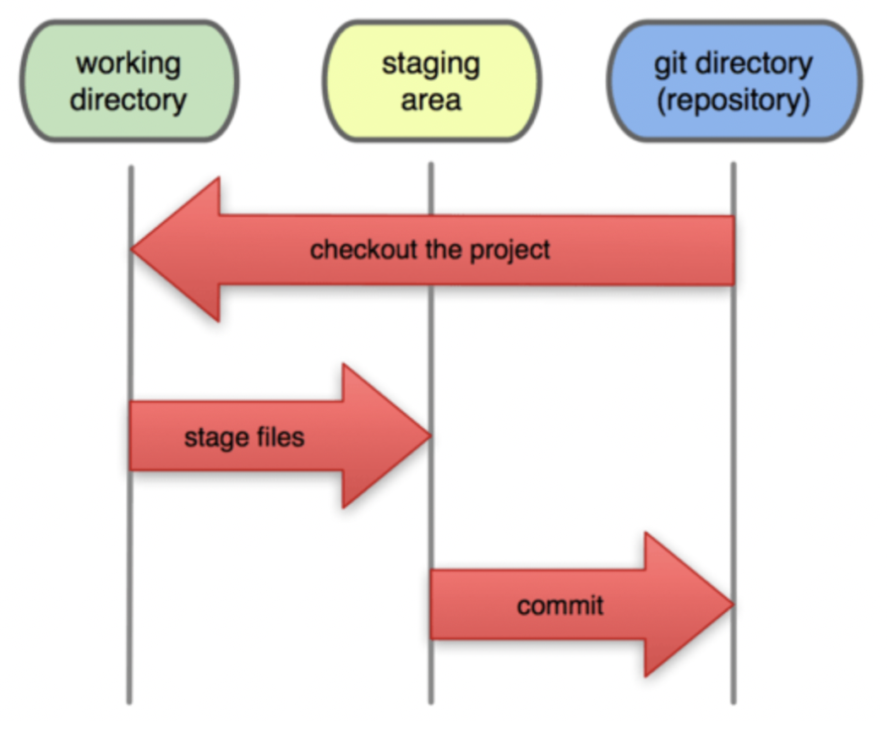
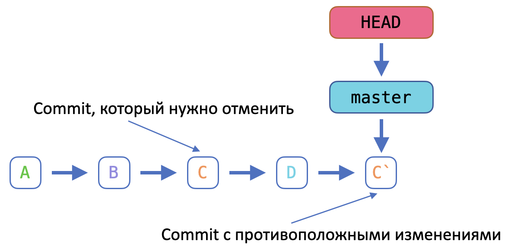

# Global Information Tracker (GIT)

- [Global Information Tracker (GIT)](#global-information-tracker-git)
  - [Системы контроля версий](#системы-контроля-версий)
    - [Введение](#введение)
    - [Виды СКВ](#виды-скв)
  - [Установка GIT](#установка-git)
  - [Состояния GIT](#состояния-git)
  - [Базовые команды GIT](#базовые-команды-git)
    - [`git init` - создание репозитория](#git-init---создание-репозитория)
    - [`git status` - статус репозитория](#git-status---статус-репозитория)
    - [`git add` - переместить файлы в подготовленную область](#git-add---переместить-файлы-в-подготовленную-область)
    - [`git commit` - добавление изменений в репозиторий](#git-commit---добавление-изменений-в-репозиторий)
  - [Стандартный рабочий процесс](#стандартный-рабочий-процесс)
  - [Значение commit](#значение-commit)
  - [Другие команды](#другие-команды)
    - [`git diff` - изменения в файлах](#git-diff---изменения-в-файлах)
    - [`git log` - история коммитов](#git-log---история-коммитов)
    - [`git show` - изменения определенного коммита](#git-show---изменения-определенного-коммита)
    - [`git blame` - информация об изменении каждой строки файла](#git-blame---информация-об-изменении-каждой-строки-файла)
  - [Откат изменений](#откат-изменений)
    - [`git clean` - удаление untracked файлов](#git-clean---удаление-untracked-файлов)
    - [`git restore` - отмена изменений файлов](#git-restore---отмена-изменений-файлов)
    - [`git revert` - откат коммита через создание нового](#git-revert---откат-коммита-через-создание-нового)
    - [`git reset` - сбрасывает коммит](#git-reset---сбрасывает-коммит)
    - [`git commit --amend` - изменение в описании последнего коммита](#git-commit---amend---изменение-в-описании-последнего-коммита)
    - [`git stash` - сохранение изменений без коммита](#git-stash---сохранение-изменений-без-коммита)
  - [Перемещение назад](#перемещение-назад)
    - [`git checkout` - переключение на commit/tag](#git-checkout---переключение-на-committag)
  - [Ветвление](#ветвление)
    - [`git branch` - управление ветками](#git-branch---управление-ветками)
    - [`git checkout -b` - быстрое создание ветки и переключение на нее](#git-checkout--b---быстрое-создание-ветки-и-переключение-на-нее)
    - [`git merge` - слияние двух веток](#git-merge---слияние-двух-веток)
      - [Базовый случай](#базовый-случай)
      - [Слияние с конфликтами](#слияние-с-конфликтами)
  - [Игнорирование файлов](#игнорирование-файлов)
  - [Github](#github)
    - [`git clone` - клонирование удаленного репозитория](#git-clone---клонирование-удаленного-репозитория)
    - [`git remote -v` - параметры удаленного репозитория](#git-remote--v---параметры-удаленного-репозитория)
    - [`git remote add` - добавление удаленного репозитория](#git-remote-add---добавление-удаленного-репозитория)
    - [`git pull` - скачать обновления с удаленного репозитория](#git-pull---скачать-обновления-с-удаленного-репозитория)
    - [`git push` - загрузить обновления на удаленного репозиторий](#git-push---загрузить-обновления-на-удаленного-репозиторий)
  - [Тренажер GIT](#тренажер-git)

## Системы контроля версий

### Введение

Version Control System (система контроля версий, СКВ) регистрирует изменения в файлах, хранит историю изменений и дает возможность вернуться к определенным старым версиям этих файлов.

Зачем:

- помогает отследить всю историю изменений файлов
- упрощает поиск изменений
- дает возможность отката определенных изменений в проекте
- упрощает и контролирует работу в команде, гарантирует отсутствие перезаписи и дублирования
- дает возможность восстановить данные

[GIT](https://git-scm.com) самая распространенная, но не единственная система. Так же существуют [Bitkeeper](http://www.bitkeeper.org), [Apache Subversion (SVN)](https://subversion.apache.org), [Mercurial](https://www.mercurial-scm.org) и другие.

### Виды СКВ

- Локальная  
    Хранит информацию о всех изменениях в базе данных, которая находится локально на компьютере.  
    \+ предоставляет нужный функционал с высокой скоростью.  
    \- единая точка отказа  
    \- невозможность совместной разработки

- Централизованная  
    Есть удаленный центральный репозиторий откуда разработчики загружают копии файлов, вносят изменения и выгружают измененные файлы обратно.  
    \+ возможность распределенной разработки  
    \+ полный контроль администратором  
    \- единая точка отказа  

- Децентрализованная  
    Центрального репозитория нет, все участники равноправны.  
    \+ возможность распределенной разработки  
    \+ возможность работать без подключения к репозиторию

## Установка GIT

Установку описана в файле [02.installation.md](../02.installation/02.installation.md) для [windows](../02.installation/02.installation.md#git) и [ubuntu](../02.installation/02.installation.md#git-1)

Минимально необходимые настройки:

- указать имя пользователя
- указать email пользователя

GIT будет подписывать все изменения этой meta информацией.

```bash
user@host01:~$ git config --global user.name alexigna
user@host01:~$ git config --global user.email ignatov.alx@gmail.com

user@host01:~$ git config --list | grep user
user.name=alexigna
user.email=ignatov.alx@gmail.com
```

> *флаг `--global` задает глобальные значения по умолчанию, их можно переопределить для каждого проекта отдельно теми же командами, но без флага `--global`*

## Состояния GIT

Три основных состояния, в которых могут находиться файлы
репозитория:

- измененное - файл поменялся, но ещё не был зафиксирован
- подготовленное - измененный файл, отмеченный для включения в следующий commit
- зафиксированное - файл уже сохранён в вашей локальной базе

Этим состояниям соответствуют три области:

- рабочая директория (working directory) - содержит то, с чем сейчас идет работа
- директория GIT (git directory) - репозиторий, в котором сохранена вся история проекта
- область подготовленных файлов (staging area) - файл, хранящийся в каталоге GIT и содержащий информацию о том, что должно войти в следующий commit

<p align="center"></p>

## Базовые команды GIT

### `git init` - создание репозитория

Репозиторий создается командой `git init`

```bash
user@host01:~/my-project$ git init
Initialized empty Git repository in /home/user/my-project/.git/
```

- в директории создается служебный каталог .git, в котором хранится вся информация по проекту
- git начинает "следить" за всеми изменениями файлов в директории

### `git status` - статус репозитория

```bash
user@host01:~/my-project$ git status
On branch master

No commits yet

nothing to commit (create/copy files and use "git add" to track)
```

Добавляем файлы и опять проверяем статус:

```bash
user@host01:~/my-project$ echo "some text" > my_file.txt

user@host01:~/my-project$ git status
On branch master

No commits yet

Untracked files:
  (use "git add <file>..." to include in what will be committed)
 my_file.txt

nothing added to commit but untracked files present (use "git add" to track)
```

`Untracked files` - неотслеживаемые файлы.

### `git add` - переместить файлы в подготовленную область

```bash
user@host01:~/my-project$ git add my_file.txt 

user@host01:~/my-project$ git status
On branch master

No commits yet

Changes to be committed:
  (use "git rm --cached <file>..." to unstage)
 new file:   my_file.txt
```

> подготовленную область еще называют "индексом"

`git add .` для добавления всех Untracked files в индекс

### `git commit` - добавление изменений в репозиторий

```bash
user@host01:~/my-project$ git commit -m "init commit"
[master (root-commit) 36b7a51] init commit
 1 file changed, 1 insertion(+)
 create mode 100644 my_file.txt
```

флаг `-m` задает описание коммита, которое вместе с временем коммита, пользователем, содержится в meta информации коммита.

> флаг `-am` позволяет одновременно добавить все файлы в индекс и сделать коммит: `git commit -am "my commit"`, но только для тех файлов, которые уже были ранее добавлены в репозиторий, т.е. для новых файлов работать не будет.

## Стандартный рабочий процесс

- инициализация репозитория (`git init`)
- внесение изменений в файлы в рабочей области
- добавление файлов в индекс (`git add`)
- создание коммитов, файлы из индекса сохраняются в репозиторий (`git commit`)

Индекс нужен для формирования набора файлов, которые попадают в следующий коммит

Коммит это фиксация индекса в локальном репозитории

<p align="center"></p>

## Значение commit

commit - логическое завершение некой задачи. Может быть большим и включать много файлов/изменений, а может быть маленьким. Главное стараться придерживаться правила атомарности, т.е. коммит должен выполнять одну задачу.

Шаблоны конфигураций хранятся в GIT ->
изменились параметры NTP -> отдельный коммит -> исправлены опечатки -> коммит -> изменены настройки OSPF -> коммит на изменения.

## Другие команды

### `git diff` - изменения в файлах

```bash
user@host01:~/my-project$ git diff
diff --git a/template.j2 b/template.j2
index e3b60ff..2d5cea4 100644
--- a/template.j2
+++ b/template.j2
@@ -12,7 +12,7 @@ interface Tunnel1
  ip nhrp nhs {{ dmvpn.hub.main.ip  }} nbma {{ dmvpn.hub.main.nbma }}
  ip nhrp registration no-unique
  ip tcp adjust-mss 1232
- load-interval 30
+ load-interval 60
  tunnel source Cellular0
  tunnel destination {{ dmvpn.hub.main.nbma }}
  tunnel key {{ interfaces.tunnel.1.key }}

user@host01:~/my-project$ git commit -am "change load interval"
[master be86458] change load interval
 1 file changed, 1 insertion(+), 1 deletion(-)
```

`git diff` показывает изменения тех файлов, которые еще не были добавлены в индекс.
Полезные опции:

- `git diff template.j2` - изменения только по одному файлу
- `git diff --staged template.j2` - изменения добавленного в индекс файла
- `git diff HEAD` - разница между рабочей директорией и репозиторием
- `git diff --stat` - краткая информация по изменениям
- `git diff master..my_branch template.j2` - разница файла между двумя ветками

### `git log` - история коммитов

```bash
user@host01:~/my-project$ git log
commit be86458d93e9eb868e3729ffd57a7c9892d26e22 (HEAD -> master)
Author: alexigna <ignatov.alx@gmail.com>
Date:   Thu Feb 22 09:02:10 2024 +0000

    change load interval

commit 85c853f97c41540c63d3b5f2d7f65df6b7c6ae92
Author: alexigna <ignatov.alx@gmail.com>
Date:   Thu Feb 22 09:01:22 2024 +0000

    add template
```

`git log` показывает историю выполненных коммитов. Полезные опции:

- `git log -p` - выводит историю коммитов с изменениями по каждому "коммиту" (патч)
- `git log -p -2` - выводит историю с патчем для последних двух коммитов
- `git log --oneline` - краткая информация по "коммитам"
- `git log --oneline --since=1.minutes` - временной фильтр (коммиты за последнюю минуту)
  - `--until="Apr 4 2024"` до 4 апреля 2024 года
  - `--since="Apr 1 2024"` начиная с 1 апреля 2024 года
  - `--since="20 minutes ago"` за последние 20 минут

### `git show` - изменения определенного коммита

```bash
user@host01:~/my-project$ git show 85c853f
commit 85c853f97c41540c63d3b5f2d7f65df6b7c6ae92
Author: alexigna <ignatov.alx@gmail.com>
Date:   Thu Feb 22 09:01:22 2024 +0000

    add template

diff --git a/template.j2 b/template.j2
new file mode 100644
index 0000000..e3b60ff
--- /dev/null
+++ b/template.j2
@@ -0,0 +1,26 @@
+!
+interface Loopback0
+ description -= RID =-
+ ip address {{ interfaces.loopback.0.ip }} 255.255.255.255
+!
+interface Tunnel1
+ description {{ interfaces.tunnel.1.description }}
```

### `git blame` - информация об изменении каждой строки файла

```bash
user@host01:~/my-project$ git blame template.j2
...
85c853f9 (alexigna 2024-02-22 09:01:22 +0000  6) interface Tunnel1
85c853f9 (alexigna 2024-02-22 09:01:22 +0000  7)  description {{ interfaces.tunnel.1.description }}
...
85c853f9 (alexigna 2024-02-22 09:01:22 +0000 14)  ip tcp adjust-mss 1232
a6a28ea5 (alexigna 2024-02-22 09:44:25 +0000 15)  load-interval 30
85c853f9 (alexigna 2024-02-22 09:01:22 +0000 16)  tunnel source Cellular0
```

## Откат изменений

### `git clean` - удаление untracked файлов

```bash
user@host01:~/my-project$ echo "123" > ttt.txt
user@host01:~/my-project$ git status
On branch master
Untracked files:
  (use "git add <file>..." to include in what will be committed)
  ttt.txt

nothing added to commit but untracked files present (use "git add" to track)
user@host01:~/my-project$ git clean -f
Removing ttt.txt
user@host01:~/my-project$ git status
On branch master
nothing to commit, working tree clean
```

### `git restore` - отмена изменений файлов

Команда `git restore` отменяет изменения файлов в рабочей директории

```bash
user@host01:~/my-project$ git status
On branch master
Changes not staged for commit:
  (use "git add <file>..." to update what will be committed)
  (use "git restore <file>..." to discard changes in working directory)
  modified:   template.j2

no changes added to commit (use "git add" and/or "git commit -a")
user@host01:~/my-project$ git restore
fatal: you must specify path(s) to restore
user@host01:~/my-project$ git restore .
```

Флаг `--staged` сбрасывает индекс.

```bash
user@host01:~/my-project$ git status
On branch master
Changes to be committed:
  (use "git restore --staged <file>..." to unstage)
  modified:   template.j2

user@host01:~/my-project$ git restore --staged template.j2
user@host01:~/my-project$ git status
On branch master
Changes not staged for commit:
  (use "git add <file>..." to update what will be committed)
  (use "git restore <file>..." to discard changes in working directory)
  modified:   template.j2

no changes added to commit (use "git add" and/or "git commit -a")
```

### `git revert` - откат коммита через создание нового

"Коммиты" это движение вперед
<p align="center"></p>

`git revert` создает новый коммит с противоположными изменениями указанному

<p align="center"></p>

```bash
user@host01:~/my-project$ git log --oneline
a6a28ea (HEAD -> master) rollback load interval
be86458 change load interval
85c853f add template
e5b5512 test
36b7a51 init commit
user@host01:~/my-project$ 
user@host01:~/my-project$ 
user@host01:~/my-project$ git revert a6a28ea
[master 1712dad] Revert "rollback load interval"
 2 files changed, 1 insertion(+), 2 deletions(-)
user@host01:~/my-project$ 
user@host01:~/my-project$ git log --oneline
1712dad (HEAD -> master) Revert "rollback load interval"
a6a28ea rollback load interval
be86458 change load interval
85c853f add template
e5b5512 test
36b7a51 init commit
```

### `git reset` - сбрасывает коммит

```bash
user@host01:~/my-project$ git log --oneline
39ef0c9 (HEAD -> master) Revert "name to loopback1"
b0818a7 name to loopback3
ee73478 name to loopback2
69c96b0 name to loopback1

user@host01:~/my-project$ git reset HEAD~1
Unstaged changes after reset:
M template.j2
user@host01:~/my-project$ git log --oneline
b0818a7 (HEAD -> master) name to loopback3
ee73478 name to loopback2
69c96b0 name to loopback1
```

<p align="center"></p>

### `git commit --amend` - изменение в описании последнего коммита

```bash
user@host01:~/my-project$ git log --oneline -1
ee73478 (HEAD -> master) name to loopback2

user@host01:~/my-project$ git commit --amend -m "changed commit msg"
[master bf8aad4] changed commit msg
 Date: Thu Feb 22 10:38:40 2024 +0000
 1 file changed, 1 insertion(+), 1 deletion(-)

user@host01:~/my-project$ git log --oneline -1
bf8aad4 (HEAD -> master) changed commit msg
```

> в реальности выполняется `git reset HEAD~` и затем новый `git commit`

### `git stash` - сохранение изменений без коммита

Мы в процессе изменений, но срочно требуется внести другие правки. `git stash` позволяет сохранить сделанные изменения в специальную область, внести срочные правки (и "закоммитить" их), а потом вернуть наши сохраненные изменения и продолжить работу.

```bash
user@host01:~/my-project$ git stash
Saved working directory and index state WIP on fix-4: 73116e7 change readme

<---какие-то срочные изменения с "коммитом"--->

user@host01:~/my-project$ git stash pop
Auto-merging template.j2
On branch fix-4
Changes not staged for commit:
  (use "git add <file>..." to update what will be committed)
  (use "git restore <file>..." to discard changes in working directory)
  modified:   README.md
  modified:   template.j2

no changes added to commit (use "git add" and/or "git commit -a")
Dropped refs/stash@{0} (2d957ea28e39c62aba1ee2867d93bdf5632a046d)
```

## Перемещение назад

### `git checkout` - переключение на commit/tag

```bash
user@host01:~/my-project$ git log --oneline
bf8aad4 (HEAD -> master) changed commit msg
69c96b0 name to loopback1
1712dad Revert "rollback load interval"
a6a28ea rollback load interval
be86458 change load interval
85c853f add template

user@host01:~/my-project$ git checkout be86458
Note: switching to 'be86458'.
...
Or undo this operation with:

  git switch -

HEAD is now at be86458 change load interval
user@host01:~/my-project$ git log --oneline
```

`git checkout master` или `git switch -` для переключения обратно

## Ветвление

- ветка (branch) - набор коммитов, которые идут друг за другом (история commit)
- у каждой ветки есть название
- новая ветка – реализация нового функционала, исправление багов и пр.
- создание ветки это создание нового указателя на определенный коммит

<p align="center"></p>

### `git branch` - управление ветками

- Создание ветки

  ```bash
  user@host01:~/my-project$ git branch my_new_branch
  ```

- Просмотр созданных веток

  ```bash
  user@host01:~/my-project$ git branch
  * fix-123
    master
    my_new_branch
  ```

- Удаление ветки
  
  ```bash
  user@host01:~/my-project$ git branch -d my_new_branch
  Deleted branch my_new_branch (was bf8aad4).
  ```

### `git checkout -b` - быстрое создание ветки и переключение на нее

Команда `git checkout -b` наиболее часто используемая опция для создания новой ветки от текущего коммита и переключения на новую ветку.

```bash
user@host01:~/my-project$ git branch
  fix-123
* master
user@host01:~/my-project$ git checkout -b test
Switched to a new branch 'test'
user@host01:~/my-project$ git branch
  fix-123
  master
* test
```

### `git merge` - слияние двух веток

#### Базовый случай

Находясь в целевой ветке (куда хотим сделать слияние) выполняем команду `git merge <ветка откуда хотим забрать изменения>`

```bash
user@host01:~/my-project$ git switch master
Switched to branch 'master'

user@host01:~/my-project$ git merge fix-123 -m "some merge msg"
Updating bf8aad4..e1e5adf
Fast-forward (no commit created; -m option ignored)
 template.j2 | 1 -
 1 file changed, 1 deletion(-)
```

Операция создает специальный коммит merge типа.

#### Слияние с конфликтами

В случае, когда в разных ветках модифицировался одни и те же данные, git не сможет понять, какая из модификаций верная и должна остаться в результате слияния. Такие случаи решаются человеком вручную.

```text
<<<<<<< HEAD
<изменения в нашей текущей ветке (куда вливаем)>
=======
<входящие изменения (откуда вливаем)>
>>>>>>> fix-333
```

```bash
user@host01:~/my-project$ git merge fix-333
Auto-merging template.j2
CONFLICT (content): Merge conflict in template.j2
Automatic merge failed; fix conflicts and then commit the result.

user@host01:~/my-project$ cat template.j2 
!
<<<<<<< HEAD
interface Tunnel3
=======
interface Tunnel2
>>>>>>> fix-333
 description {{ interfaces.tunnel.1.description }}

user@host01:~/my-project$ git commit -am "merge from fix-333"
[master 1e80ead] merge from fix-333
```

## Игнорирование файлов

В процессе работы создаются файлы, которые не нужно добавлять в git, например logs, служебные файлы, артефакты, кеш, тесты и прочее. Они не несут никакой полезной информации и при добавлении в git только засоряют историю. GIT позволяет описать правила для автоматического игнорирования таких файлов (и директорий). Правила описываются в файле `.gitignore` в корневой директории проекта. Существуют уже подготовленные "шаблоны" для наиболее частых целей. Один из вариантов [gitignore](https://github.com/github/gitignore/blob/main/Python.gitignore) для python.

## Github

Репозиторий в github и на локальном компьютере абсолютно равнозначны. Github удобен как уже готовое средство обмена между несколькими разработчиками. Так же github предоставляет дополнительные возможности, например анализ кода на уязвимости, github actions (cicd).

### `git clone` - клонирование удаленного репозитория

```bash
user@host01:~$ git clone git@github.com:alsigna/codewars.git
Cloning into 'codewars'...
remote: Enumerating objects: 47, done.
remote: Counting objects: 100% (47/47), done.
remote: Compressing objects: 100% (35/35), done.
remote: Total 47 (delta 10), reused 39 (delta 6), pack-reused 0
Receiving objects: 100% (47/47), 12.95 KiB | 6.47 MiB/s, done.
Resolving deltas: 100% (10/10), done.
user@host01:~$ 
```

### `git remote -v` - параметры удаленного репозитория

флаг `-v` выводит информацию о текущих настройках удаленного репозитория (или нескольких)

```bash
user@host01:~/codewars$ git remote -v
origin  git@github.com:alsigna/codewars.git (fetch)
origin  git@github.com:alsigna/codewars.git (push)
```

### `git remote add` - добавление удаленного репозитория

```bash
user@host01:~/my-project$ git remote add origin git@github.com:alsigna/testsss.git
user@host01:~/my-project$ git branch
* master
user@host01:~/my-project$ git push -u origin master
Enumerating objects: 41, done.
Counting objects: 100% (41/41), done.
Delta compression using up to 2 threads
Compressing objects: 100% (35/35), done.
Writing objects: 100% (41/41), 3.52 KiB | 1.17 MiB/s, done.
Total 41 (delta 19), reused 0 (delta 0), pack-reused 0
remote: Resolving deltas: 100% (19/19), done.
To github.com:alsigna/testsss.git
 * [new branch]      master -> master
Branch 'master' set up to track remote branch 'master' from 'origin'.
```

### `git pull` - скачать обновления с удаленного репозитория

Данные с удаленного репозитория не поступают автоматически на локальный компьютер. Для скачивания обновлений с удаленного репозитория нужно выполнить команду `git pull`

```bash
user@host01:~/my-project$ git pull
remote: Enumerating objects: 5, done.
remote: Counting objects: 100% (5/5), done.
remote: Compressing objects: 100% (2/2), done.
remote: Total 3 (delta 0), reused 1 (delta 0), pack-reused 0
Unpacking objects: 100% (3/3), 974 bytes | 974.00 KiB/s, done.
From github.com:alsigna/testsss
   1e80ead..4669e7a  master     -> origin/master
Updating 1e80ead..4669e7a
Fast-forward
 README.md | 1 -
 1 file changed, 1 deletion(-)
```

### `git push` - загрузить обновления на удаленного репозиторий

Аналогично и загрузка обновлений с локального компьютера в удаленный репозиторий не происходит автоматически. Для этого существует команда `git push`

```bash
user@host01:~/my-project$ git push
Enumerating objects: 5, done.
Counting objects: 100% (5/5), done.
Delta compression using up to 2 threads
Compressing objects: 100% (2/2), done.
Writing objects: 100% (3/3), 335 bytes | 335.00 KiB/s, done.
Total 3 (delta 0), reused 0 (delta 0), pack-reused 0
To github.com:alsigna/testsss.git
   4669e7a..73116e7  master -> master
```

## Тренажер GIT

[LearnGitBranching](https://learngitbranching.js.org/?locale=ru_RU)
