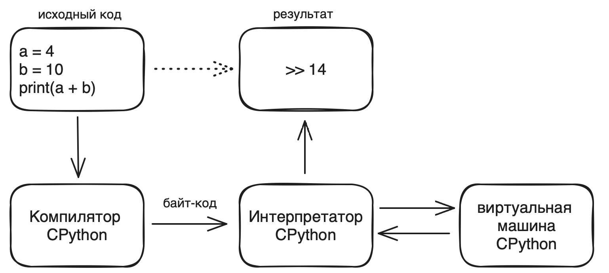

# Python

- Высокоуровневый язык программирования.
- Написан на C (есть и другие варианты JPython (java), PyPy (python) и пр)
- Язык с неявной строгой динамической типизацией
  - Неявная типизация - при объявлении переменной не нужно указывать её тип
  - Динамическая типизация - тип переменной определяется во время выполнения программы, в ходе работы программы можно в одну переменную складывать данные различного типа
  - Строгая типизация - нельзя совершать операции над переменными разного типа
    > Нельзя, например, сложить строку с числом. Но позволяет в одну и ту же переменную записать сначала число, а потом строку.
- Интерпретируемый
    > Python компилирует код в байт-код, но затем интерпретирует этот байт-код
    

    > Интерпретатор выполняет код строго в том порядке, который описан разработчиком. Каждая инструкция пишется на новой строке или разделяются `;`
- Поставляется с большим числом базовых библиотек: [список](https://docs.python.org/3/library/index.html)
