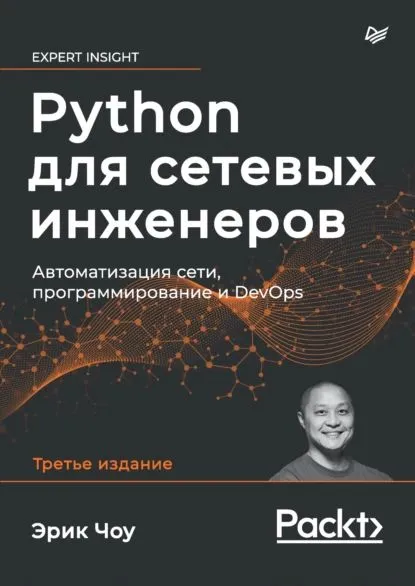

# Python - базовый курс

## Введение

**Python** (питон, пайтон) - один из самых популярных и используемых языков программирования.  
В рейтинге [PYPL](https://pypl.github.io/PYPL.html) находится на первом месте

Области применения:

- data science / machine learning
- web-разработка
- gamedev
- автоматизация
- обучение

## Зачем python сетевому инженеру

- автоматизация и помощь в рутинных задачах
- взаимодействие с оборудование по API
- генерация и валидация конфигураций
- тестирование
- служебные микросервисы

## Плюсы и минусы python

### Плюсы

- простой и понятный синтаксис
- достаточно низкий порог входа
- кросплатформенность
- широкое распространение и большое комьюнити
- мощный функционал
- огромное число готовых библиотек и модулей под любые цели
- включен в школьную программу

### Минусы

- скорость выполнения программ
- сложность
- GIL (Global Interpreter Lock)

## Темы курса

- Подготовка к работе (установка python, IDE)
- Основы GIT
- Типы данных (числа, строки, словари) и типизация
- Переиспользование кода (циклы/условия, функции, модули, пакеты)
- Работа с файлами
- Регулярные выражения
- Работа с шаблонами (Jinja2, TextFSM)
- Подключение к сетевому оборудованию (paramiko, netmiko, scrapli)
- Основы ООП
- Паттерны проектирования (декоратор, singleton, фабрика, итератор)
- Асинхронный код
- Полезные библиотеки (FastAPI, Redis, Scapy)
- Основы pytest

## Домашнее задание

- После каждой темы (почти)
- Один (?) "большой" проект
- Использование github для проверки домашнего задания

## Самостоятельное изучение

### Книги

- Программируем на Python | Доусон Майкл  
  

- Автоматизация рутинных задач с помощью Python | Эл Свейгарт  
  

- Чистый Python | Дэн Бейдер  
  

- [Python для сетевых инженеров](https://pyneng.readthedocs.io/ru/latest/) | Наташа Самойленко  
  

- Python для сетевых инженеров | Эрик Чоу  
  

### Практика

- [codewars](https://www.codewars.com/)
- [leetcode](https://leetcode.com)
- [adventofcode](https://adventofcode.com)
- [поколение python (stepik)](https://stepik.org/course/58852/)

### Видео

- [Тимофей Хирьянов](https://www.youtube.com/@tkhirianov)
- [Python для сетевых инженеров (Наташа Самойленко)](https://www.youtube.com/playlist?list=PLah0HUih_ZRljCWNZp2N-YBVkgxiJZWEY)

### WEB

- [real python](https://realpython.com)
- [proglib](https://proglib.io/)
- [тренажер stepik](https://stepik.org/course/431/info)
- [yandex контекст](https://contest.yandex.ru)
