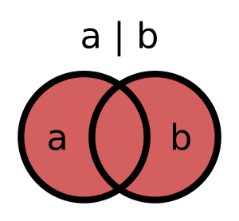
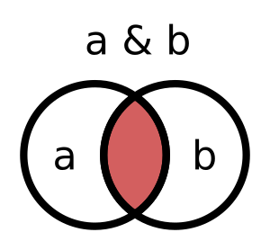
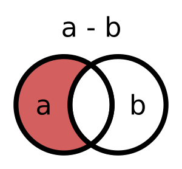
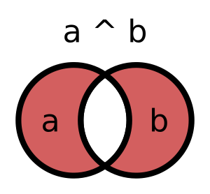

# Множества (set)

- [Множества (set)](#множества-set)
  - [Описание](#описание)
  - [Создание](#создание)
  - [Полезные функции и методы](#полезные-функции-и-методы)
    - [`in`, `not in` - проверка на наличие объекта во множетве](#in-not-in---проверка-на-наличие-объекта-во-множетве)
    - [`len()` - длина множества](#len---длина-множества)
    - [`set.add()` - добавление элемента](#setadd---добавление-элемента)
    - [`set.discard()`, `set.remove()` - добавление элемента](#setdiscard-setremove---добавление-элемента)
    - [`set.union()`, `|` - объединение множеств](#setunion----объединение-множеств)
    - [`set.intersection()`, `&` - пересечение множеств](#setintersection----пересечение-множеств)
    - [`set.difference()`, `-` - разность множеств](#setdifference-----разность-множеств)
    - [`set.symmetric_difference()`, `^` - симметрическая разность](#setsymmetric_difference----симметрическая-разность)

## Описание

Множество это **неупорядоченная** **изменяемая** последовательность **уникальных** элементов.  

- неупорядоченная - элементы хранятся не в том порядке, в котором были помещены во множество
- изменяемая - можно удалять/добавлять элементы
- уникальность - каждый элемент встречается только один раз, повторы не допускаются

Множества хранят элементы только в одном экземпляре, этим они похожи на ключи в словарях (так же не могут повторяться).

## Создание

Явное задание

```python
In [139]: s = {1, 2, 3, 2, 1}

In [140]: s
Out[140]: {1, 2, 3}

In [141]: type(s)
Out[141]: set
```

Создание пустого множетва. `{}` уже занят словарем.

```python
In [147]: s = set()

In [148]: s
Out[148]: set()
```

Преобразование типов

```python
In [142]: l = [1, 3, 2, 3, 2, 1]

In [143]: set(l)
Out[143]: {1, 2, 3}

In [149]: set("ololo")
Out[149]: {'l', 'o'}
```

## Полезные функции и методы

### `in`, `not in` - проверка на наличие объекта во множетве

Работает аналогично `in`, `not in` в других коллекциях

```python
In [150]: intfs = {"gi0/0", "gi0/1", "gi0/2"}

In [151]: "gi0/1" in intfs
Out[151]: True

In [152]: "gi0/43" not in intfs
Out[152]: True
```

### `len()` - длина множества

```python
In [154]: intfs = {"gi0/0", "gi0/1", "gi0/2"}

In [155]: len(intfs)
Out[155]: 3
```

### `set.add()` - добавление элемента

```python
In [156]: intfs.add("gi0/3")

In [157]: intfs
Out[157]: {'gi0/0', 'gi0/1', 'gi0/2', 'gi0/3'}
```

### `set.discard()`, `set.remove()` - добавление элемента

Обе функции удаляют элемент из множетва, но `set.discard()` не вызывает исключение если элемент отсутсвует, а `set.remove()` - вызывает.

```python
In [159]: intfs.discard("gi0/1")
In [160]: intfs.discard("gi0/1")

In [161]: intfs.remove("gi0/1")
---------------------------------------------------------------------------
KeyError                                  Traceback (most recent call last)
Cell In[161], line 1
----> 1 intfs.remove("gi0/1")

KeyError: 'gi0/1'
```

### `set.union()`, `|` - объединение множеств

<p align="center"></p>

```python
In [168]: intf_set1 = {"gi0/1", "gi0/2"}
In [169]: intf_set2 = {"gi0/2", "gi0/3"}

In [170]: intf_set1 | intf_set2
Out[170]: {'gi0/1', 'gi0/2', 'gi0/3'}

In [171]: intf_set1.union(intf_set2)
Out[171]: {'gi0/1', 'gi0/2', 'gi0/3'}

In [172]: intf_set2.union(intf_set1)
Out[172]: {'gi0/1', 'gi0/2', 'gi0/3'}
```

### `set.intersection()`, `&` - пересечение множеств

<p align="center"></p>

```python
In [175]: intf_set1.intersection(intf_set2)
Out[175]: {'gi0/2'}
```

### `set.difference()`, `-` - разность множеств

<p align="center"></p>

```python
In [178]: intf_set1.difference(intf_set2)
Out[178]: {'gi0/1'}

In [179]: intf_set2.difference(intf_set1)
Out[179]: {'gi0/3'}
```

### `set.symmetric_difference()`, `^` - симметрическая разность

Похожа на `XOR`.

<p align="center"></p>

```python
In [180]: intf_set1.symmetric_difference(intf_set2)
Out[180]: {'gi0/1', 'gi0/3'}
```
