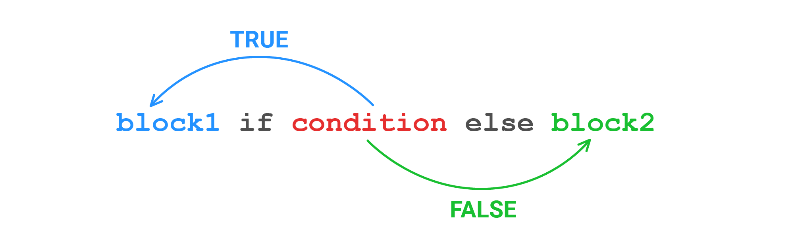

# Условия (if/elif/else)

- [Условия (if/elif/else)](#условия-ifelifelse)
  - [Описание](#описание)
  - [`if`](#if)
  - [Проверка истинности](#проверка-истинности)
    - [Булев тип](#булев-тип)
    - [Приведение типов](#приведение-типов)
    - [Логические операторы](#логические-операторы)
    - [Операторы сравнения](#операторы-сравнения)
    - [`in`, `not in` - проверка наличия элемента в коллекции](#in-not-in---проверка-наличия-элемента-в-коллекции)
    - [`is` - сравнение объектов на идентичность](#is---сравнение-объектов-на-идентичность)
  - [`elif`](#elif)
  - [`else`](#else)
  - [Тернарный оператор](#тернарный-оператор)

## Описание

Условные конструкции позволяют менять логику выполнения программы. Делать ветвления и включать или выключать блоки кода на основании логических условий.

## `if`

```python
In [181]: name = "rt1"

In [182]: if name == "rt1":
     ...:     print("router")
     ...: 
router
```

`name == "rt1"` - условное выражение, если результат `True`, тогда код внутри блока будет выполнен, если `False` - пропущен.

`if` задает начало условной секции.

## Проверка истинности

### Булев тип

`True` и  `False` это самые простые и очевидные значения.

### Приведение типов

Условием выполнения блока кода условной конструкции является истина (True) условного выражения. При этом в python работает неявное приведение типов. В частности:

- `True`
  - любое число, не равное 0
  - или любой непустой объект, например непустая строка, не пустой список
- `False`
  - число, равное 0 (0, 0.0, ...)
  - пустые объекты, ("" - пустая строка, [] - пустой список, [""] - при этом равен `True`)
  - `None` - `False`
  
Можно проверить результат используя явное пребразование типов:

```python
In [186]: bool("router1")
Out[186]: True

In [187]: bool("")
Out[187]: False

In [188]: bool([1, 2])
Out[188]: True

In [189]: bool([])
Out[189]: False

In [190]: bool([""])
Out[190]: True

In [191]: bool(43)
Out[191]: True

In [192]: bool(0.0)
Out[192]: False

In [193]: bool(None)
Out[193]: False
```

```python
In [196]: if my_list:
     ...:     print("list is not empty")
list is not empty
```

### Логические операторы

`and`, `or`, `not` - логичские И, ИЛИ, НЕ.

```python
In [198]: if my_list and 0:
     ...:     print("блок никогда не будет исполнен")
     ...:
```

```python
In [199]: if [] or not 0:
     ...:     print("блок будет исполнен всегда")
     ...: 
will always be executed
```

```python
In [216]: device = {"password": "cisco", "ip": "192.168.1.2"}

In [217]: device.get("password") or "UNKNOWN"
Out[217]: 'cisco'

In [218]: device.get("username") or "UNKNOWN"
Out[218]: 'UNKNOWN'
```

### Операторы сравнения

```python
In [201]: 4 > 2
Out[201]: True

In [202]: 4 < 2
Out[202]: False

In [203]: 4 != 2
Out[203]: True

In [204]: 4 == 2
Out[204]: False
```

```python
In [207]: my_list = [1, 2, 3]

In [208]: if len(my_list) != 0:
     ...:     print("лист содержит элементы")
     ...: 
лист содержит элементы
```

### `in`, `not in` - проверка наличия элемента в коллекции

`in` - возвращает `True` если элемент есть в коллекции, и `False` если нет

`not in` - комбинация логического оператора `not` и `in`

```python
In [213]: if vlan in vlans:
     ...:     print(f"vlan{vlan} включен на интерфейсе")
     ...: 
vlan300 включен на интерфейсе
```

### `is` - сравнение объектов на идентичность

Обычно используется только для сравнения с `None`, т.к. `None` существуют в единственном экземпляре и все переменные со значением `Nonе` ссылаются на один и тот же объект в памяти.

```python
In [248]: device = {"password": "cisco", "ip": "192.168.1.2"}

In [249]: if device.get("username") is None:
     ...:     print("username отсутсвует в словаре данных")
     ...: 
username отсутсвует в словаре данных
```

## `elif`

Альтернативный `if`. Необязательный блок. Если нужно создать несколько веток кода, тогда в качестве второй и последующей проверки используется `elif`.

```python
In [232]: a = 5
     ...: 
     ...: if a > 20:
     ...:     print(f"{a} больше 20")
     ...: elif a < 10:
     ...:     print(f"{a} меньше 10")
     ...: 
5 меньше 10
```

Почему `elif` - в рамках одной условной секции может быть только один открывающий `if`.

два `if` = две условных секции. Секции не зависят друг от друга, поэтому значение переменной `a` проверяется два раза: в каждой из секции.

```python
In [233]: if a < 10:
     ...:     print(f"{a} меньше 10")
     ...: if a < 20:
     ...:     print(f"{a} меньше 20")
     ...: 
5 меньше 10
5 меньше 20
```

один `if` = одна условная секции. Значит будет выполнен код только того блока, условие которого будет истиной.

```python
In [234]: if a < 10:
     ...:     print(f"{a} меньше 10")
     ...: elif a < 20:
     ...:     print(f"{a} меньше 20")
     ...: 
5 меньше 10
```

## `else`

закрывающий условную секцию блок. Нобязательны блок. Будет выполнен если ни одно из условий выше не был истиной.

```python
In [241]: a = 15
     ...: 
     ...: if a > 20:
     ...:     print(f"{a} больше 20")
     ...: elif a < 10:
     ...:     print(f"{a} меньше 10")
     ...: else:
     ...:     print(f"{a} где-то между 10 и 20")
     ...: 
15 где-то между 10 и 20
```

## Тернарный оператор

В простых ситуациях можно использовать тернарный оператор, вместо развернутой формы.

<p align="center"></p>

```python
In [223]: result = True
In [223]: 'успешно' if result else 'с ошибкой'
Out[223]: 'успешно'

In [225]: print(f"скрипт выполнен {'успешно' if result else 'с ошибкой'}")
скрипт выполнен успешно

In [226]: result = False
In [227]: print(f"скрипт выполнен {'успешно' if result else 'с ошибкой'}")
скрипт выполнен с ошибкой
```
