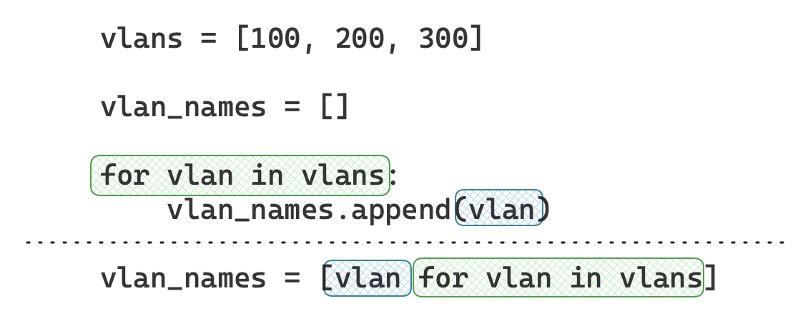
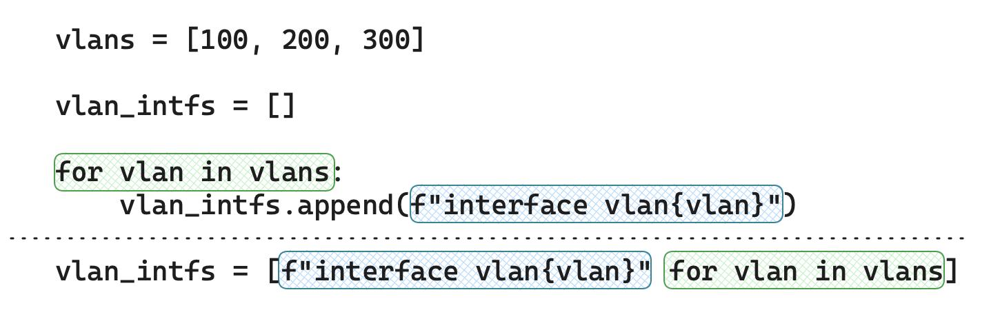
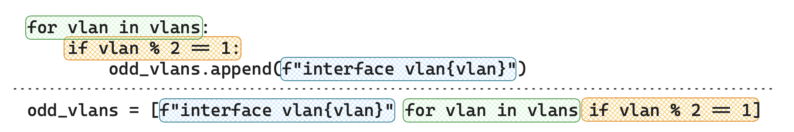
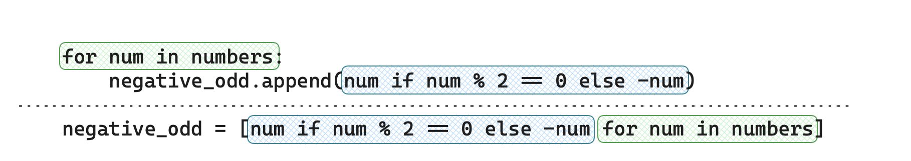
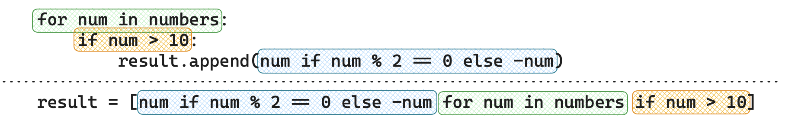

# Циклы (for/while)

- [Циклы (for/while)](#циклы-forwhile)
  - [Описание](#описание)
  - [`for`](#for)
    - [Описание](#описание-1)
    - [`for` и изменяемые (mutable) типы](#for-и-изменяемые-mutable-типы)
    - [`range`](#range)
    - [`continue`](#continue)
    - [`break`](#break)
    - [`pass`](#pass)
    - [`for/else`](#forelse)
    - [`enumerate`](#enumerate)
  - [`while`](#while)
    - [Описание](#описание-2)
    - [`pass`, `continue`, `break`](#pass-continue-break)
    - [`else`](#else)
  - [list comprehension](#list-comprehension)
  - [tuple comprehension](#tuple-comprehension)
  - [dict comprehension](#dict-comprehension)

## Описание

Циклы позволяют применять один и тот же набор действий (блок кода) к разным элементам последовательности. Последовательностью может быть:

- строка
- список
- кортеж
- множество
- словарь
- и прочие объекты, позволяющие делать перебор своих элементов

В python существуют два типа циклов: `for` и `while`.

Цикл `for` используется когда заранее известно число операций. Он нагляднее, короче и проще читается чем `while`. Так же `for` самостоятельно управляет своими итерациями (сам извлекает нужные данные, сам следит что последовательность кончилась).

## `for`

### Описание

Цикл `for` извлекает элемент последовательности по-порядку (с первого до последнего) и проводит с проводит с извлеченным элементом операции, описанные в своем блоке кода (тело цикла).

```python
for <переменная> in <последовательность>:
    <блок кода, тело цикла>

<глобальный блок кода, за пределами цикла
и не имеющий к нему отношение>
```

Подход без цикла, повторяем одно и то же действие несколько раз

```python
In [72]: text = "code"

In [73]: print(text[0])
c

In [74]: print(text[1])
o

In [75]: print(text[2])
d

In [76]: print(text[3])
e
```

Цикл позволяет свернуть эти повторяющиеся действия:

```python
In [77]: text = "code"

In [78]: for char in text:
    ...:     print(char)
    ...: 
c
o
d
e
```

Более сложный пример:

```python
In [62]: mask = "255.255.255.240"

# мы хотим сделать перебор по октетам, а не по символам
# поэтому получим список октетов, разбив mask по '.'
In [63]: mask_octets = mask.split(".")
In [64]: mask_octets
Out[64]: ['255', '255', '255', '240']

# создадим пустой список, куда будем записывать октеты wildcard маски
In [65]: wildcard_octets = []

# для каждого октета из mask_octets сделаем вычисление октета wildcard маски
# у нас строковые данные, поэтому преобразуем в int, вычтем это значение
# из 255, преобразуем разность обратно в строку и добавим в wildcard_octets
In [66]: for octet in mask_octets:
    ...:     wildcard_octets.append(str(255 - int(octet)))
    ...: 

# в результате работы цикла мы заполнили лист с октетами wildcard маски
In [67]: wildcard_octets
Out[67]: ['0', '0', '0', '15']

# функцией join мы сможем склеить строковые элементы списка в единую строку
In [68]: ".".join(wildcard_octets)
Out[68]: '0.0.0.15'
```

Перебираемая последовательность может не быть адресована через какую-либо переменную, а создаваться непосредственно в определении цикла.

```python
In [90]: # "huawei", "cisco", "arista" - это tuple, т.к. скобки можно опускать
In [91]: for vendor in "huawei", "cisco", "arista":
    ...:     print(vendor.upper())
    ...: 
HUAWEI
CISCO
ARISTA
```

### `for` и изменяемые (mutable) типы

Для каждого элемента из коллекции python выполняет присвоение элемента переменной цикла.  

```python
for <переменная> in <последовательность>:
    <тело цикла>
```

можно понимать как: возьмем очередной элемент из <последовательность>, присвоем это значение в <переменная> и передадим в <тело цикла>.  

При этом присвоение данных переменной в python это создание ссылки на данные, a это значит, что модификация данных через <переменная> будет сохраняться в исходной <последовательность>.

В качестве элементов последовательности (tuple) используются списки. Тип list - изменяемый.

```python
In [69]: seq = ([1], [2], [3], [4])

In [70]: for s in seq:
    ...:     # в качестве элемента последовательности используется список
    ...:     # значит его модификация меняет сам элемент, а не создает
    ...:     # новые данные
    ...:     s.append(s[0] + 1)
    ...: 

# исходная последовательность в результате работы цикла поменялась
In [71]: seq
Out[71]: ([1, 2], [2, 3], [3, 4], [4, 5])
```

В качестве элементов используется тип str - неизменяемый.

```python
In [84]: seq = ["one", "two", "three"]

In [85]: for s in seq:
    ...:     # строки не изменяемы, поэтому тут мы создаем 
    ...:     # новую строку и переназначаем ссылку на данные
    ...:     s = s.upper()
    ...:     print(s)
    ...: 
ONE
TWO
THREE

# исходная последовательность не изменилась
In [86]: seq
Out[86]: ['one', 'two', 'three']
```

### `range`

Основное использование цикла `for` это:

- перебор элементов последовательности и выполнение каких-либо действий с каждым элементом
- выполнение некоторого кода заданное число раз

Для повторения цикла некоторое заданное число раз `n` можно использовать цикл `for` вместе с функцией `range()`.

> `range()` создает неизменяемую последовательность чисел, поэтому фактически использование range сводится к перебору элементов из объекта, который создает range.

```python
In [107]: for i in range(4):
     ...:     print(i)
     ...: 
0
1
2
3
```

Создание последовательности только для целей использования в цикле for настолько популярный подход, что `range`, был выделен в [отдельный тип](https://docs.python.org/3/library/stdtypes.html#ranges) python.

```python
In [122]: type(range(3))
Out[122]: range
```

Несколько вариантов использования `range()`:

- `range(STOP)` - от нуля до STOP-1
- `range(START, STOP)` - от START до STOP-1
- `range(START, STOP, STEP)` - от START до STOP-1 с шагом STEP

```python
In [108]: for i in range(3, 0, -1):
     ...:     print(i)
     ...: 
3
2
1
```

```python
In [227]: for i in range(10):
     ...:     print(f"interface Ethernet{i // 5}/{i % 5}")
     ...: 
interface Ethernet0/0
interface Ethernet0/1
interface Ethernet0/2
interface Ethernet0/3
interface Ethernet0/4
interface Ethernet1/0
interface Ethernet1/1
interface Ethernet1/2
interface Ethernet1/3
interface Ethernet1/4
```

> `range()` может использоваться и как самостоятельная функция для генерации последовательности.

```python
In [118]: vlans = "100-110"
In [119]: vlans_list = vlans.split("-")
In [120]: list(
     ...:     range(
     ...:         int(vlans_list[0]),
     ...:         int(vlans_list[1]) + 1,
     ...:     )
     ...: )
     ...: 
Out[120]: [100, 101, 102, 103, 104, 105, 106, 107, 108, 109, 110]
```

### `continue`

Оператор `continue` позволяет перейти к следующей итерации (вернуться в начало и взять следующий элемент), пропустив оставшиеся инструкции тела цикла.

```python
In [131]: for i in range(10):
     ...:     if i % 2 == 0:
     ...:         print(f"interface Ethernet0/{i}")
     ...: 
interface Ethernet0/0
interface Ethernet0/2
interface Ethernet0/4
interface Ethernet0/6
interface Ethernet0/8
```

```python
In [134]: devices = [
     ...:     "rt1.lan.hq.net",
     ...:     "p1.mpls.hq.net",
     ...:     "p2.mpls.hq.net",
     ...:     "sw1.lan.hq.net",
     ...:     "dsw1.lan.hq.net",
     ...: ]

In [135]: for device in devices:
     ...:     if not device.endswith("lan.hq.net"):
     ...:         continue
     ...:     print(device)
     ...: 
rt1.lan.hq.net
sw1.lan.hq.net
dsw1.lan.hq.net
```

### `break`

Оператор `break` позволяет досрочно завершить (прервать) цикл.

```python
In [139]: devices = [
     ...:     "rt1.lan.hq.net",
     ...:     "p1.mpls.hq.net",
     ...:     "p2.mpls.hq.net",
     ...:     "sw1.lan.hq.net",
     ...:     "dsw1.lan.hq.net",
     ...: ]

In [140]: for device in devices:
     ...:     if device.startswith("sw"):
     ...:         break
     ...:     print(device)
     ...: 
rt1.lan.hq.net
p1.mpls.hq.net
p2.mpls.hq.net

In [141]: device
Out[141]: 'sw1.lan.hq.net'
```

> В случае вложенных циклов оператор `break` прерывает только тот цикл, в котором он был вызван.

### `pass`

Оператор `pass` это самостоятельная инструкция, которая ничего не делает. Оператор, в основном, используется в процессе разработки как заглушка под будущий код.

```python
In [147]: devices = [
     ...:     "rt1.lan.hq.net",
     ...:     "p1.mpls.hq.net",
     ...:     "p2.mpls.hq.net",
     ...:     "sw1.lan.hq.net",
     ...:     "dsw1.lan.hq.net",
     ...: ]

In [148]: for device in devices:
     ...:     if device.startswith(("sw", "dsw")):
     ...:         # TODO: дописать обработку для коммутаторов
     ...:         pass
     ...:     elif device.startswith(("rt", "p")):
     ...:         print(f"обрабатываем маршрутизатор {device}")
     ...:     else:
     ...:         print(f"неизвестный класс устройства {device}")
     ...: 
обрабатываем маршрутизатор rt1.lan.hq.net
обрабатываем маршрутизатор p1.mpls.hq.net
обрабатываем маршрутизатор p2.mpls.hq.net
```

### `for/else`

В цикле `for` существует завершающий блок `else`:

- выполняется после завершения цикла, если он не был прерван оператором `break`
- не выполняется если в цикле сработал оператор `break`

```python
In [152]: devices = [
     ...:     "rt1.lan.hq.net",
     ...:     "p1.mpls.hq.net",
     ...:     "p2.mpls.hq.net",
     ...: ]

In [153]: for device in devices:
     ...:     if device.startswith(("sw", "dsw")):
     ...:         break
     ...:     print(device)
     ...: else:
     ...:     print("среди устройств нет коммутаторов")
     ...: 
rt1.lan.hq.net
p1.mpls.hq.net
p2.mpls.hq.net
среди устройств нет коммутаторов
```

Цикл прерван `break` при итерации с 4ым элементом ("sw1.lan.hq.net") - блок `else` не выполняется

```python
In [150]: devices = [
     ...:     "rt1.lan.hq.net",
     ...:     "p1.mpls.hq.net",
     ...:     "p2.mpls.hq.net",
     ...:     "sw1.lan.hq.net",
     ...:     "dsw1.lan.hq.net",
     ...: ]

In [151]: for device in devices:
     ...:     if device.startswith(("sw", "dsw")):
     ...:         break
     ...:     print(device)
     ...: else:
     ...:     print("среди устройств нет коммутаторов")
     ...: 
rt1.lan.hq.net
p1.mpls.hq.net
p2.mpls.hq.net
```

### `enumerate`

Полезная функция, которая позволяет получить кортеж вида `(индекс, элемент последовательности)` на каждой итерации цикла, вместо просто `элемент последовательности`.

```python
In [157]: enumerate?
Init signature: enumerate(iterable, start=0)
...
enumerate is useful for obtaining an indexed list:
    (0, seq[0]), (1, seq[1]), (2, seq[2]), ...
Type:           type
Subclasses:     
```

```python
In [159]: devices = [
     ...:     "rt1.lan.hq.net",
     ...:     "p1.mpls.hq.net",
     ...:     "p2.mpls.hq.net",
     ...:     "sw1.lan.hq.net",
     ...:     "dsw1.lan.hq.net",
     ...: ]

In [160]: for indx, device in enumerate(devices):
     ...:     print(f"элемент с индексом {indx} равен {device}")
     ...: 
элемент с индексом 0 равен rt1.lan.hq.net
элемент с индексом 1 равен p1.mpls.hq.net
элемент с индексом 2 равен p2.mpls.hq.net
элемент с индексом 3 равен sw1.lan.hq.net
элемент с индексом 4 равен dsw1.lan.hq.net
```

Используется, когда нужно отслеживать индекс элемента как альтернатива ручному подсчету:

```python
In [162]: indx = -1
In [163]: for device in devices:
     ...:     indx += 1
     ...:     print(f"элемент с индексом {indx} равен {device}")
     ...: 
элемент с индексом 0 равен rt1.lan.hq.net
элемент с индексом 1 равен p1.mpls.hq.net
элемент с индексом 2 равен p2.mpls.hq.net
элемент с индексом 3 равен sw1.lan.hq.net
элемент с индексом 4 равен dsw1.lan.hq.net
```

## `while`

### Описание

Цикл `while` является универсальным и может полностью заменить `for`, но при этом разработчику нужно самостоятельно получать элементы из последовательности, следить, что она не закончилась. В целом `while` более сложный для чтения и понимания, как следствие - менее используемый, чем `for`.

Общая структура цикла:

```python
while <логическое выражение>:
     <тело цикла>
```

Если <логическое выражение> истино (True), тогда выполняется <тело цикла>. Выполняется оно до тех пор, пока <логическое выражение> остается истиным, как только <логическое выражение> становится ложным (False), цикл завершает свою работу.

Пример бесконечного цикла: логическое выражение неизменно и всегда истино.

```python
while True:
     print("бесконечный цикл")
```

При использовании цикла `while` необходимо самостоятельно следить за итерациями и определять когда цикл должен быть закончен.

```python
In [174]: i = 3

In [175]: while i >= 0:
     ...:     print(i)
     ...:     i -= 1
     ...: 
3
2
1
0
```

Цикл `for`

```python
In [187]: for i, device in enumerate(devices):
     ...:     print(f"номер итерации {i=}, элемент итерации: {device=}")
     ...: 
номер итерации i=0, элемент итерации: device='rt1.lan.hq.net'
номер итерации i=1, элемент итерации: device='p1.mpls.hq.net'
номер итерации i=2, элемент итерации: device='p2.mpls.hq.net'
номер итерации i=3, элемент итерации: device='sw1.lan.hq.net'
номер итерации i=4, элемент итерации: device='dsw1.lan.hq.net'
```

Может быть переписан через `while`, но он становится менее удобным:

```python
In [185]: i = 0

In [186]: while i < len(devices):
     ...:     device = devices[i]
     ...:     print(f"номер итерации {i=}, элемент итерации: {device=}")
     ...:     i += 1
     ...: 
номер итерации i=0, элемент итерации: device='rt1.lan.hq.net'
номер итерации i=1, элемент итерации: device='p1.mpls.hq.net'
номер итерации i=2, элемент итерации: device='p2.mpls.hq.net'
номер итерации i=3, элемент итерации: device='sw1.lan.hq.net'
номер итерации i=4, элемент итерации: device='dsw1.lan.hq.net'
```

### `pass`, `continue`, `break`

Операторы `pass`, `continue` и `break` универсальные и работают точно так же, как в цикле `for`:

- `pass` - оператор-заглушка, позволяющий ничего не делать
- `break` - досрочно прерывает работу цикла
- `continue` - пропустить оставшиеся инструкции в теле цикла и перейти на следующую итерацию

> при использовании while и continue важно, что бы модификация переменных, на основе которых вычисляется логическое выражение, менялось до того, как будет вызван оператор continue. В противном случае получится бесконечный цикл.

```python
In [214]: i = 0

In [215]: text = "code"

In [216]: while i < len(text):
     ...:     char = text[i]
     ...:     print(char)
     ...:     if char == "d":
     ...:         continue
     ...:     i += 1
     ...: 
c
o
d
d
d
d
...
```

Желательно переменные, из которых вычисляется логическое выражение, менять как можно раньше в теле цикла (в идеале - первой инструкцией).

```python
In [223]: i = -1

In [224]: text = "code"

In [225]: while i < len(text) - 1:
     ...:     i += 1
     ...:     char = text[i]
     ...:     if char == "d":
     ...:         continue
     ...:     print(char)
     ...: 
c
o
e
```

### `else`

Поведение оператора `else` в цикле `while` аналогичное поведению `for/else`:

- блок кода в `else` выполнется когда цикл завершится (логическое условие станет ложным)
- не выполняется если цикл был прерван оператором `break`

```python
In [193]: text = "code"
In [194]: i = 0
In [195]: status = False

In [196]: while i < len(text):
     ...:     char = text[i]
     ...:     print(char)
     ...:     i += 1
     ...:     if char == "d":
     ...:         break
     ...: else:
     ...:     status = True
     ...: 
c
o
d

In [197]: if status:
     ...:     print("цикл полностью завершился")
     ...: else:
     ...:     print("цикл был прерван break")
     ...: 
цикл был прерван break
```

## list comprehension

List Comprehension очень распространный и простой способ составления списков. Нормального перевода на русский язык этой конструкции нет, поэтому будет называться "генератор списка".

В общем случае это способ преобразования последовательности в список. При этом с каждым элементом можно производить некие одинаковые действия (например преобразование типов, передачу в функцию и получение результата, арифметические операции и прочее).

Самая простая запись это

```python
vlans = [100, 200, 300]

vlan_names = [vlan for vlan in vlans]
```

В этом примере мы никак не модифицируем элемент последовательности vlans, поэтому просто создается копия исходного списка. В полной форме цикла `for` это эквивалентно записи

```python
vlans = [100, 200, 300]
vlan_names = []
for vlan in vlans:
     vlan_names.append(vlan)
```

<p align="center"></p>

Но с элементом последоветельности можно проводить вычисления, например:

```python
vlans = [100, 200, 300]

vlan_intfs = [f"interface vlan{vlan}" for vlan in vlans]

# состав vlan_intfs: ['interface vlan100', 'interface vlan200', 'interface vlan300']

vlan_str = [str(vlan) for flan in vlans]
# состав vlan_str: ['300', '300', '300']
```

<p align="center"></p>

Кроме этого list comprehension поддерживает условия: if и тернарный оператор:

```python
vlans = [100, 101, 102, 103, 104, 105]

odd_vlans = [f"interface vlan{vlan}" for vlan in vlans if vlan % 2 == 1]
# ['interface vlan101', 'interface vlan103', 'interface vlan105']

even_vlans = [f"interface vlan{vlan}" for vlan in vlans if vlan % 2 == 0]
# ['interface vlan100', 'interface vlan102', 'interface vlan104']
```

<p align="center"></p>

Чтобы получить тернарный оператор нужно блоки `if` и `for` поменять местами:

```python
numbers = [1, 2, 3, 4, 5, 6]

negative_odd = [num if num % 2 == 0 else -num for num in numbers]
# [-1, 2, -3, 4, -5, 6]
```

<p align="center"></p>

Можно комбинировать `if` и тернарный оператор:

```python
numbers = [1, 2, 3, 4, 11, 12, 13, 14]

for num in numbers:
    if num > 10:
        result.append(num if num % 2 == 0 else -num)

result = [num if num % 2 == 0 else -num for num in numbers if num > 10]
# [-11, 12, -13, 14]
```

<p align="center"></p>

Так же циклы `for` внутри генератора циклов могут быть вложенными, и с какого-то момента выражение становится сложным для понимания и восприятия. В этом случае лучше упросить его и сделать часть через обычный цикл `for`.

## tuple comprehension

Отличаатеся от list comprehension только скобками выражения `tuple()` вместо `[]`, и, как следствие, получаемым в результате типом: tuple вместо list:

```python

numbers = [1, 2, 3, 4, 5, 6]

negative_odd = [num if num % 2 == 0 else -num for num in numbers]
# [-1, 2, -3, 4, -5, 6] - лист

negative_odd = tuple(num if num % 2 == 0 else -num for num in numbers)
# (-1, 2, -3, 4, -5, 6) - кортеж
```

> Задается именно через `tuple()`, а не просто `()`. Если указать только `()`, то результатом будет объект генератор

## dict comprehension

Генератор словарей. Принципиально не отличаются от генератора списков, но так как словарь это набор вида <ключ>:<значение>, то и формироваться он должен с указанием обоих параметров, а не только одного элемента (как в случае списка).

Например есть список именнованых кортежей (namedtuple) InterfaceStatus из [домашнего задания](/998.hw.tasks/016.lists.and.tuples.md#task5-namedtuple). И нужно превратить его в словарь, с ключом равным имени интерфейса, и значением равным InterfaceStatus.

```python

from collections import namedtuple

InterfaceStatus = namedtuple("InterfaceStatus", ["name", "ip", "ok", "method", "status", "protocol"])

intf_brief = [
    InterfaceStatus(name='Gig0/2', ip='192.168.190.235', ok='YES', method='unset', status='up', protocol='up'),
    InterfaceStatus(name='Gig0/4', ip='192.168.191.2', ok='YES', method='unset', status='up', protocol='down'),
    InterfaceStatus(name='Ten2/1', ip='unassigned', ok='YES', method='unset', status='up', protocol='up'),
    InterfaceStatus(name='Ten3/4', ip='unassigned', ok='YES', method='unset', status='down', protocol='down'),
]

intf_dict = {intf.name: intf for intf in intf_brief}
```

Это равносильно следующему циклу:

```python
intf_dict = {}
for intf in intf_brief:
     intf_dict[intf.name] = intf
```
