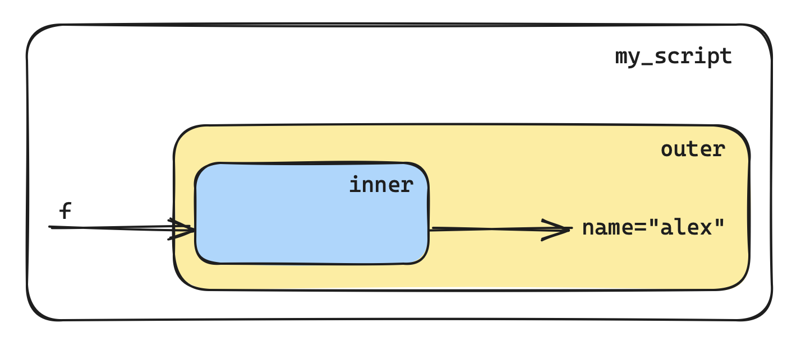

# Функции

- [Функции](#функции)
  - [Описание](#описание)
  - [Создание](#создание)
  - [Возвращение значений](#возвращение-значений)
  - [Документация](#документация)
  - [Вложенные функции](#вложенные-функции)
  - [Область видимости](#область-видимости)
    - [global](#global)
    - [local](#local)
    - [nonlocal](#nonlocal)
    - [enclosing](#enclosing)
    - [built-in](#built-in)
    - [LEGB](#legb)
  - [Типы аргументов (параметров)](#типы-аргументов-параметров)
    - [Обязательные и необязательные параметры](#обязательные-и-необязательные-параметры)
    - [Позиционные и именованные аргументы](#позиционные-и-именованные-аргументы)
  - [Параметры переменной длины](#параметры-переменной-длины)
  - [Анонимные функции](#анонимные-функции)
  - [`globals` и `locals`](#globals-и-locals)
  - [Рекурсия](#рекурсия)

## Описание

Функции это один из основных инструментов для создания удобного структурированного кода. Они позволяют группировать набор инструкций, которые выполняют отдельную логически завершенную задачу. Этот сгруппированный набор инструкций можно неоднократно переиспользовать.

## Создание

Для создания используется ключевое слово `def` за которым следует имя функции и круглые скобки `()`. В скобках указываются параметры функции (если они есть) и в конце строки ставится `:`.

```python
def my_func(username):
    print(f"hello {username}")
```

Вызов функции в коде происходит через её имя и передачу аргументов (если трубуется):

```python
my_func("user")
# >>> hello user
```

- параметры - переменные, используемые при инициализации функции
- аргументы - данные, используемые при вызове функции

При создании функции происходит только её инициализация, но сама функция не выполнятся. Выполнение происходит в тот момент, когда эта функция вызывается в коде.

## Возвращение значений

Функция всегда возвращает результат своей работы. Если явно не указано, то по умолчанию функция возвращает `None`. Указать явно возвращаемый результат можно через ключевые слова `return` или `yield` (вернемся позже, в теме генераторов).

```python
def get_interface_name(config_line):
    if config_line.strip().startswith("interface "):
        if_name = config_line.split(maxsplit=1)[-1]
        return if_name
    else:
        return ""

get_interface_name("sdfdsf")
# >>> ''

get_interface_name(" interface gi0/0")
# >>> 'gi0/0'
```

Ключевое слово `return` означает завершение работы фукции, удаляется стек функции (область памяти, которая была создана под ёе выполнение), удаляются все переменные, которые были созданы внутри функции, пользователю возвращается только результат (то, что написано после `return`).

После `return` может идти несколько объектов через запятую, тогда функция будет возвращать кортеж из этих объектов. При вызове функции можно либо сразу распаковать эти возвращаемые объекты в отдельные переменные, либо получить их как кортеж и дальше использовать доступ по индексу.

```python
def get_devices():
    routers = [f"rt{i:02}" for i in range(1,3)]
    switches = [f"sw{i:02}" for i in range(1,5)]
    return routers, switches

get_devices()
# >>> (['rt01', 'rt02'], ['sw01', 'sw02', 'sw03', 'sw04'])

rt, sw = get_devices()

rt
# >>> ['rt01', 'rt02']

sw
# >>> ['sw01', 'sw02', 'sw03', 'sw04']
```

## Документация

Для документации работы функции используется docstrings - краткое описание назначения функции, параметров, возвращаемого результата.

```python
def get_interface_name(config_line):
    """возвращает имя интерфейса из переданной строки конфигурации"""
    if config_line.strip().startswith("interface "):
        if_name = config_line.split(maxsplit=1)[-1]
        return if_name
    else:
        return ""
```

или

```python
def get_interface_name(config_line):
    """возвращает имя интерфейса из переданной строки конфигурации

    Args:
        config_line (str): строка, где ищем имя

    Returns:
        str: имя интерфейса, "" (пустая строка) если имя не найдено
    """
    if config_line.strip().startswith("interface "):
        if_name = config_line.split(maxsplit=1)[-1]
        return if_name
    else:
        return ""
```

## Вложенные функции

Возможно использование вложенных друг в друга функций.

```python
def func1():
    def func2():
        print("функция func2")

    def func3():
        def func4():
            print("функция func4")

        print("функция func3")
        func4()

    print("функция func1")
    func2()
    func3()

func1()
# >>> функция func1
# >>> функция func2
# >>> функция func3
# >>> функция func4
```

## Область видимости

Область видимости (scope) это та часть кода, где доступна та или иная переменная.

### global

Переменные в глобальная области определены вне любой из функций и доступны в любом месте программы.

```python
user = "alex"

print(f"hello {user} from global")

# >>> hello alex from global

def greeting():
    print(f"hello {user} from func")

greeting()
# >>> hello alex from func
```

Глобальные переменные удобны, но делают код не гибким, менее безопасным, сложно читаемым.

### local

Локальные переменные это переменные определенные внутри функции и доступны только внутри её тела.

```python
def print_log_1():
    block = "A"
    print(f"device in block {block}")

def print_log_2():
    block = "B"
    print(f"device in block {block}")

print_log_1()
# >>> device in block A

print_log_2()
# >>> device in block B
```

Локальные переменные могут маскировать глобальные, т.е. можно использовать одно и то же имя, при этом внутри функции будет использовано значение локальной переменной, а за пределеами фунции будет использовано значение глобальной переменной.

```python
site = "HQ"

def print_log():
    site = "MSK"
    print(f"error on site: {site}")

print(f"error on site: {site}")
# >>> error on site: HQ

print_log()
# >>> error on site: MSK
```

Немутальбельные глобальные переменные доступны для чтения внутри функции. Но недоступны для изменения.

```python
device = "rt01"

print(f"reloading {device}")
# >>> reloading rt01

def change_current_device(new_device):
    device = new_device
    print(f"device changed to {new_device}")

change_current_device("sw01")
# >>> device changed to sw01

device
# >>> 'rt01'
```

Для изменения значения немутабельной глобальной переменной внутри функции используется ключевое слово `global`:

```python
device = "rt01"

device
# >>> 'rt01'

def change_current_device(new_device):
    global device
    device = new_device
    print(f"device changed to {new_device}")

change_current_device("sw01")
# >>> device changed to sw01

device
# >>> 'sw01'
```

Мутабельные глобальные переменные могут быть изменены внутри функции.

```python
devices = ["r1"]

devices
# >>> ['r1']

def add_device(device):
    devices.append(device)
    print(f"{device} has been added")

add_device("sw1")
# >>> sw1 has been added

devices
# >>> ['r1', 'sw1']
```

### nonlocal

Ключевое слово `nonlocal` позволяет выходить из локальной области видимости на верхний уровень (но не на глобальный). Это ключевое слово актульно когда используются вложенные функции.

```python
def outer():
    def inner():
        # в локальной области функции inner создается переменная x,
        # по завершению inner функции эти данные удаляются,
        # данные, записанные в переменную x функции outer никак не модифицируются
        x = 2
    x = 1
    print("outer:", x)
    inner()
    print("outer:", x)

outer()
# >>> outer: 1
# >>> outer: 1
```

```python
def outer():
    def inner():
        # теперь x это переменная из области видимости функции outer,
        # поэтому её изменение сохранится после завершения работы inner
        nonlocal x
        x = 2
    x = 1
    print("outer:", x)
    inner()
    print("outer:", x)

outer()
# >>> outer: 1
# >>> outer: 2
```

### enclosing

Замыкание это функция, которая запоминает значения переменных из своей внешней области видимости, даже если эта область уже недоступна.

```python
def outer(name):
    def inner():
        print(f"hello {name}")
    
    return inner

f = outer("alex")
f()
# >>> hello alex
```

<p align="center"></p>

Функция `inner` имеет доступ к области видимости функции `outer` даже после того, как функция `outer` завершила свою работу.

```python
def multiplier(factor):
    def closure(x):
        return factor * x

    return closure

m2 = multiplier(2)
m3 = multiplier(3)

m2(3)
# >>> 6
m3(3)
# >>> 9
```

```python
def protect(password):
    def inner(user_password):
        if user_password == password:
            print("allowed")
        else:
            print("denied")
    return inner

login = protect("P@ssw0rd")
login("P@ssw0rd")
# >>> allowed
login("secret")
# >>> denied
```

- каждое замыкание хранит своё состояние, они не пересекаются
- предоставляет интерфейс для работы с состоянием, скрывает прямой доступ к ним и помогает избежать использования `global`

### built-in

Встроенная область python, автоматически формируется при запуске скрипта. Зарезервированные значения.

### LEGB

Python ищет переменную в порядке в каждой из областей:

- local
- enclosing
- global
- built-in

## Типы аргументов (параметров)

При инициализациии и вызове функции аргументы (и параметры) можно разделить на несколько вариантов:

- обязательные и необязательные
- позиционные и именованные

### Обязательные и необязательные параметры

При определении функции есть возможность задать значение по умолчанию для параметра, в этом случае его можно не передавать в функцию.

```python
def check_user(username, password, min_len=0):
    print(f"{username=}")
    print(f"{password=}")
    if min_len and len(password) < min_len:
        print("password is too short")

check_user("tom", "123")
# >>> username='tom'
# >>> password='123'

check_user("tom", "123", 4)
# >>> username='tom'
# >>> password='123'
# >>> password is too short
```

При определении функции параметры со значением по умолчанию всегда следуют после обязательных параметров.

> при использовании изеняемых объектов в качестве значений по умолчанию, следует помнить, что эти объекты создаются при инициализации функции, и при повторных вызовах будут использованы те же данные, что и при предыдущем вызове.

```python
def my_func(value, storage=[]):
    storage.append(value)
    return storage

f1 = my_func(1)
print(f1)
# >>> [1]

f2 = my_func(2)
print(f2)
# >>> [1, 2]
```

### Позиционные и именованные аргументы

Позиционные - при вызове функции учитывается позиция агрументов и передаваемые значения записываются в переменные согласно их порядку:

```python
def check_user(username, password, source):
    print(f"{username=}")
    print(f"{password=}")
    print(f"{source=}")

check_user("tom", "secret", "ad")
check_user("secret", "ad", "tom")
```

Именованные - при вызове функции мы явно можем указать, в какой аргумент мы передаем то или иное значение. Тогда порядок их будет не важен.

```python
check_user(
    username="tom", 
    password="secret",
    source="ad",
)
check_user(
    password="secret",
    source="ad",
    username="tom", 
)
```

Если используется распаковка, то список/кортеж распаковывается в позиционные, а словарь - в именнованные пеменные, ключи используются как имена для аргументов, поэтому должны совпадать с именами параметров функции.

```python
user = ("tom", "secret", "ad")
check_user(*user)
# >>> username='tom'
# >>> password='secret'
# >>> source='ad'

user = ("ad", "tom", "secret")
check_user(*user)
# >>> username='ad'
# >>> password='tom'
# >>> source='secret'
```

```python
user = {
    "username": "tom",
    "source": "ad",
    "password": "secret",
}

check_user(**user)
# >>> username='tom'
# >>> password='secret'
# >>> source='ad'
```

Возможно комбинация типа передачи, но при этом все позиционные аргументы должны идти вначале:

```python
check_user("tom", source="ad", password="secret")
# >>> username='tom'
# >>> password='secret'
# >>> source='ad'
```

Можно отключить возможность использовать позиционные параметры, для этого используется символ `*` и следуюущая запись:

```python
def get_command_output(hostname, command, *, timeout=30, transport="ssh", port=22):
    print(f"getting output of '{command}' on '{hostname}'")
    print("timeout:", timeout)
    print("transport:", transport)
    print("port:", port)
```

Символ `*` разделяет позиционные параметры (они все еще могут быть переданы и как именованные) и только именованные параметры.

Отключить возможность использование именованных аргументов с помощью символа `/`:

```python
def get_command_output(hostname, command, /, *, timeout=30, transport="ssh", port=22):
    print(f"getting output of '{command}' on '{hostname}'")
    print("timeout:", timeout)
    print("transport:", transport)
    print("port:", port)

get_command_output("rt1", command="sh ip int br")
---------------------------------------------------------------------------
TypeError                                 Traceback (most recent call last)
----> 1 get_command_output("rt1", command="sh ip int br")

TypeError: get_command_output() got some positional-only arguments passed as keyword arguments: 'command'
```

Теперь до комбинации `/, *,` можно передавать только позиционные аргументы, после - только именованные.

## Параметры переменной длины

Когда заранее неизвестно, какие/сколько аргументов будет передано в функцию, можно использовать параметры переменной длины:

```python
print("r1")
# >>> r1

print("device", "r1", "is", "down")
# >>> device r1 is down
```

Для определения параметров переменной длины применяются операторы упаковки/распаковки: `*` для списков/кортежей и `**` для словарей.

Комбинация определения переменных и упаковки уже встречалась:

```python
a, *b = 1, 2, 3, 4, 5

a
# >>> 1

b
# >>> [2, 3, 4, 5]
```

При определении функции используется тот же принцип:

Все позиционные аргументы упаковываются в кортеж (`*`) `args`, который доступен в локальной области видимости функции. Внутри функции с `args` можно представляет собой кортеж, с которым можно работать стандартными способами (доступ по индексу, использование в цикле и прочее).

```python
def my_func(*args):
    print(args)

my_func(1)
# >>> (1,)
my_func(1, 2, 3)
# >>> (1, 2, 3)
my_func(1, 2, "str", "device", "rt")
# >>> (1, 2, 'str', 'device', 'rt')
```

Все именованные аргументы упаковываются в словарь (`**`) `kwargs`, который доступен в локальной области видимости функции и может быть использован внутри как обычный словарь.

```python
def check_scrapli(**kwargs):
    scrapli = dict(
        hostname=kwargs.get("hostname"),
        username=kwargs.get("username"),
        password=kwargs.get("password"),
        port=kwargs.get("port", 22),
        transport=kwargs.get("transport", "system"),
    )
    if not all(scrapli.values()):
        print("invalid data")
        return
    for param, value in scrapli.items():
        print(f"{param:>10}: {value}")


check_scrapli(hostname="rt1", password="secret", username="admin")
# >>>   hostname: rt1
# >>>   username: admin
# >>>   password: secret
# >>>       port: 22
# >>>  transport: system
 
my_func(hostname="rt1", password="secret")
# >>> invalid data
```

Комбинация `*args` и `**kwargs`:

```python
def check_scrapli(*args, **kwargs):
    scrapli = dict(
        username=kwargs.get("username"),
        password=kwargs.get("password"),
        port=kwargs.get("port", 22),
        transport=kwargs.get("transport", "system"),
    )
    if not all(scrapli.values()):
        print("invalid data")
        return
    for hostname in args:
        print("-" * 30)
        print(f"{'hostname':>10}: {hostname}")
        for param, value in scrapli.items():
            print(f"{param:>10}: {value}")

check_scrapli("r1", "r2", "r3", password="secret", username="admin")
# >>> ------------------------------
# >>>   hostname: r1
# >>>   username: admin
# >>>   password: secret
# >>>       port: 22
# >>>  transport: system
# >>> ------------------------------
# >>>   hostname: r2
# >>>   username: admin
# >>>   password: secret
# >>>       port: 22
# >>>  transport: system
# >>> ------------------------------
# >>>   hostname: r3
# >>>   username: admin
# >>>   password: secret
# >>>       port: 22
# >>>  transport: system
```

> названия `args` и `kwargs` это условное соглашение между разработчиками, имена могут быть произвольными, но лучше придерживаться общепринятых стандартов.

## Анонимные функции

Анонимная функция создается в момент исполнения инструкции с использованием ключевого слова `lambda`. Она не имеет название и обычно выполняет какие-то простые действия, или передается как аргумент в другие функции. Общий формат создания:

```python
lambda param_1, param_2, ...: command
```

```python
def foo():
    return 42

print(foo())
# >>> 42

boo = lambda: 42
print(boo())
# >>> 42
```

```python
def foo(a, b):
    return a + b

print(foo(1, 2))
# >>> 3

boo = lambda a, b: a + b
print(boo(1, 2))
# >>> 3

print((lambda a, b: a + b)(1, 2))
# >>> 3
```

```python
def filter_list(seq, filter_=None):
    if filter_ is None:
        return seq
    return [i for i in seq if filter_(i)]


filter_list(l)
# >>> [1, 3, 2, -4, 5, 10, 20]

filter_list(l, lambda x: x >= 10)
# >>> [10, 20]
filter_list(l, lambda x: x % 2 == 0)
# >>> [2, -4, 10, 20]
```

Анонимная функция может быть возвращена в качестве замыкания (это такая же функция, как и "обычная" определенная через `def`):

```python
def protect(password):
    return lambda user_password: user_password == password


login = protect("P@ssw0rd")
login("P@ssw0rd")
# >>> True
login("secret")
# >>> False
```

## `globals` и `locals`

В python есть встроенные функции `globals()` и `locals()` который позволяют посмотреть содержимое соответсвующей области видимости (глобальную и локальную).

```python
def foo(value):
    x = 5
    print(locals())
    print(value, x)


foo("123")
>>> {'value': '123', 'x': 5}
>>> 123 5
```

## Рекурсия

Рекурсия это когда функция вызывает сама себя. В Python существует ограничение на количество рекурсивных вызовов. Практически всегда рекурсию можно заменить циклом, но иногда он становится слишком сложным, в то же время рекурсия может быть более проста для восприятия.

```python
>>> import sys
>>> sys.getrecursionlimit()
1000
```

При написания рекурсивной функции нужно обращать внимание на:

- условия выхода из рекурсии
- граничные случаи
- изменение данных таким образом, что бы они "двигались" к условию выхода из рекурсии

В примере нет ничего из перечисленного, поэтому рекурсия бесконечная и будет остановлена интерпретатором при достижении лимита

```python
def foo(a):
    print(a)
    foo(a + 1)

foo(0)

...
RecursionError: maximum recursion depth exceeded
```

Рекурсия на примере вычисления суммы последовательности:

```python
def sum_(seq):
    # граничный случай
    if len(seq) == 0:
        return 0
    # условие выхода из рекурсии: в последовательности только один элемент
    elif len(seq) == 1:
        return seq[0]
    # изменение данных: приближаем их к условию выхода из рекурсии
    # на каждом вызове длина последовательности уменьшается на единицу
    # в конечном итоге придем к последовательности с одним элементом
    else:
        return seq[0] + sum_(seq[1:])

sum_((1, 2, 3, 4, 5))
# >>> 15
```
