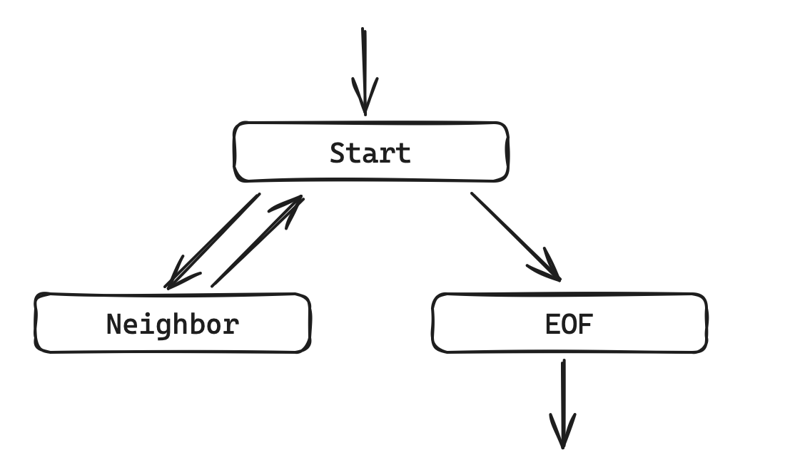

# TextFSM

- [TextFSM](#textfsm)
  - [Описание](#описание)
  - [Сущности](#сущности)
  - [Алгоритм](#алгоритм)
  - [Основы синтаксиса](#основы-синтаксиса)
  - [Использование в скрипте](#использование-в-скрипте)
  - [Переменные](#переменные)
  - [Правила](#правила)
  - [Действия](#действия)
  - [Состояния](#состояния)
  - [CLI Table](#cli-table)

## Описание

Библиотека [TextFSM](https://github.com/google/textfsm) созданная Google для обработки выводов с сетевых устройств. Для преобразования неструктурированного вывода (текст) в структурированные объекты Python (словарь/список). По сравнению с построчной обработкой кода использование TextFSM имеет ряд преимущества:

- правила парсинга вынесены из скрипта в отдельный файл
- меньше кода в скрипте
- шаблонами можно делиться или использовать уже готовые, например от [ntc](https://github.com/networktocode/ntc-templates/)
- для модификации шаблонов не нужно менять сам скрипт

TextFSM не единственный текстовый анализатор, есть еще, например [TTP](https://github.com/dmulyalin/ttp)

Может быть полезен сервис для онлайн проверки TextFSM шаблонов [textfsm.nornir.tech](http://textfsm.nornir.tech/) (аналог regex101.com для регулярных выражений)

Со временем TextFSM стал популярным и получил поддержку во фреймворках для работы с сетевым оборудованием, например netmiko, scrapli.

Не входит в список стандартных библиотек, и перед использованием должен быть установлен

```text
pip install textfsm
```

## Сущности

TextFSM оперирует основными сущностями, такими как:

- входные данные: неструктурированный текст, например вывод с оборудования
- список правил: шаблоны/правила, по которым производится обработка текста
- выходные данные: структурированный результат

## Алгоритм

- FSM читает очередную строку входных данных
- FSM проверяет строку на совпадение описанным шаблонам (правилам). Все правила проходятся сверху вниз по очереди, для каждой очередной строки.
- Если строка совпадает с правилом, тогда FSM выполняет действие, которое назначено этому правилу (например сохранение результата или переключение в другое состояние), и затем переходит к следующей строчке из входных данных.

## Основы синтаксиса

Простой шаблон может выглядеть следующим образом

```text
Value interface (\S+)
Value ip (\S+)
Value status (up|down|administratively down)
Value protocol (up|down)

Start
  # захват строки из вывода
  ^${interface}\s+${ip}\s+\w+\s+\w+\s+${status}\s+${protocol} -> Record
```

Секции, из которых состоит шаблон:

- Определение переменных: `Value [option, ...] name regex`
  - Начинается с ключевого слова Value
  - Могут присутствовать необязательные опции и флаги `[option, ...]`
  - name: имя переменной
  - regex: регулярное выражение, по которому в переменную будет запоминаться текст
- Состояния:

    ```text
    state_name
      ^rule1
      ^rule2
    ```
  
  - state_name:  имя состояния (Start - обязательное состояние)
  - ^ruleX: правила для проверки строки

## Использование в скрипте

Для использования шаблона в коде:

```python
from pathlib import Path
from pprint import pprint

import textfsm

output = """
r1#sh ip int br
Interface              IP-Address      OK? Method Status                Protocol
GigabitEthernet1       192.168.122.101 YES NVRAM  up                    up      
GigabitEthernet2       192.168.12.1    YES NVRAM  up                    up      
GigabitEthernet3       unassigned      YES NVRAM  administratively down down    
GigabitEthernet4       unassigned      YES NVRAM  administratively down down    
Loopback0              10.255.255.101  YES NVRAM  up                    up      
"""

template = Path(Path(__file__).parent, "templates", Path(__file__).name).with_suffix(".textfsm")
with open(template, "r") as f:
    fsm = textfsm.TextFSM(f)

# список переменных
fsm.header
# ['interface', 'ip', 'status', 'protocol']

# парсит вывод в список списков
fsm.ParseText(output)
# [['GigabitEthernet1', '192.168.122.101', 'up', 'up'],
#  ['GigabitEthernet2', '192.168.12.1', 'up', 'up'],
#  ['GigabitEthernet3', 'unassigned', 'administratively down', 'down'],
#  ['GigabitEthernet4', 'unassigned', 'administratively down', 'down'],
#  ['Loopback0', '10.255.255.101', 'up', 'up']]

# сбрасывает результат
fsm.Reset()

# парсит вывод в список списков
fsm.ParseTextToDicts(output)
# [{'interface': 'GigabitEthernet1',
#   'ip': '192.168.122.101',
#   'status': 'up',
#   'protocol': 'up'},
#  {'interface': 'GigabitEthernet2',
#   'ip': '192.168.12.1',
#   'status': 'up',
#   'protocol': 'up'},
#  {'interface': 'GigabitEthernet3',
#   'ip': 'unassigned',
#   'status': 'administratively down',
#   'protocol': 'down'},
#  {'interface': 'GigabitEthernet4',
#   'ip': 'unassigned',
#   'status': 'administratively down',
#   'protocol': 'down'},
#  {'interface': 'Loopback0',
#   'ip': '10.255.255.101',
#   'status': 'up',
#   'protocol': 'up'}]
```

В переменной `header` хранится список переменных шаблона (Values). Список упорядоченная последовательность, поэтому порядок значений в коде будет совпадать с порядком определения переменных в шаблоне.

Метод `ParseText()` парсит переданный в качестве аргумента текст, согласно правилам шаблона. В результате возвращается список списков, где внешний список соответствуют очередному совпадению, а внутренний список содержит значения, которые попали в переменные (порядок значений соответствует порядку определения переменных в шаблоне, так же, как и для `header`). Список списков возвращается всегда, даже если найдено только одно совпадение.

```python
[
    # первое совпадение с правилом, внутри списка то, что попало в переменные шаблона (Value)
    ['GigabitEthernet1', '192.168.122.101', 'up', 'up'],
    # второе совпадение с правилом, внутри списка то, порядок элементов внутри вложенного списка
    # соответствует порядку определения Value внутри шаблона
    ['GigabitEthernet2', '192.168.12.1', 'up', 'up'],
]
```

Если смотреть структуры TextFSM, то можно увидеть, что TextFSM преобразует шаблон в "обычные" регулярные выражения:

```python
# список Values из шаблона
In [62]: fsm.values
Out[62]: 
[<textfsm.parser.TextFSMValue at 0x107a2f560>,
 <textfsm.parser.TextFSMValue at 0x107a2f7d0>,
 <textfsm.parser.TextFSMValue at 0x107a2ff50>,
 <textfsm.parser.TextFSMValue at 0x107a2f980>]

# имя переменной
In [63]: fsm.values[0].name
Out[63]: 'interface'

# регулярное выражение, как задано в шаблоне
In [64]: fsm.values[0].regex
Out[64]: '(\\S+)'

# комбинация имени и regex из шаблона дают именованную группу для итогового сравнения
In [65]: fsm.values[0].template
Out[65]: '(?P<interface>\\S+)'

# опции, в шаблоне не указаны, поэтому пустой список
In [66]: fsm.values[0].options
Out[66]: []

# состояния, Start - единственный обязательный, и в примере содержит одно правило
In [72]: fsm.states
Out[72]: {'Start': [<textfsm.parser.TextFSMRule at 0x107a2f920>]}

# как наше правило определено в шаблоне
In [74]: fsm.states["Start"][0].match
Out[74]: '^${interface}\\s+${ip}\\s+\\w+\\s+\\w+\\s+${status}\\s+${protocol}'

# скомпилированная regex-строка для использования в python,
# в строку шаблона подставлены все именованные группы вместо переменных
In [75]: fsm.states["Start"][0].regex
Out[75]: '^(?P<interface>\\S+)\\s+(?P<ip>\\S+)\\s+\\w+\\s+\\w+\\s+(?P<status>up|down|administratively down)\\s+(?P<protocol>up|down)'

# совпадение с правилом может переключать наш автомат в другое состояние,
# но в примере этого нет, поэтому new_state пустая строка
In [76]: fsm.states["Start"][0].new_state
Out[76]: ''

# операция при совпадении с правилом, в нашем случае Record = запомнить данные
In [77]: fsm.states["Start"][0].record_op
Out[77]: 'Record'
```

Каждый вызов `ParseText()` или `ParseTextToDicts()` накапливает результат анализа, поэтому если вызвать несколько раз подряд эти методы, то будет задвоение/затроение/и т.д. результата обработки. При необходимости использовать повторно эти функции нужно делать сброс состояния методом `Reset()`

## Переменные

Переменные задаются паттерном `Value [option,...] name regex`.

- name: имя переменой, буквы/цифры/_,
- regex: шаблон re в скобках
- options: опции/флаги
  - Filldown/Fillup: совпадение запоминается в переменную для следующего/предыдущего совпадения. Т.е. значение будет копироваться в новые/старые record до тех пор, пока снова не будет совпадения с шаблоном
  - Required: совпадение сохраняется в итоговую таблицу только если переменная была найдена
  - List: переменная типа list, каждое следующее совпадение будет дописываться в список
  - Key: значение должно быть уникально в итоговой таблице

<details>
    <summary>Пример <code>Filldown</code> и <code>Required</code></summary>

```python
from pathlib import Path

import tabulate
import textfsm

output = """
r2#sh cdp ne
Capability Codes: R - Router, T - Trans Bridge, B - Source Route Bridge
                  S - Switch, H - Host, I - IGMP, r - Repeater, P - Phone, 
                  D - Remote, C - CVTA, M - Two-port Mac Relay 

Device ID        Local Intrfce     Holdtme    Capability  Platform  Port ID
r3               Gig 0/2           168              R B             Gig 0/1
r3               Gig 0/0           163              R B             Gig 0/0
r1               Gig 0/1           158              R I   CSR1000V  Gig 2
r1               Gig 0/0           158              R I   CSR1000V  Gig 1
"""

# Value Filldown local_device (\S+)
# Value Required peer_device (\S+)
# Value local_interface (\S+\s\d+(\/\d+)?)
# Value peer_platform ([\S ]+)
# Value peer_interface (\S+\s\d+(\/\d+)?)

# Start
#   # r3               Gig 0/2           168              R B             Gig 0/1
#   ^${peer_device}\s+${local_interface}\s+\d+\s+(\S\s)+\s+${peer_platform}\s+${peer_interface}$$ -> Record
#   ^${local_device}[>#]


template = Path(Path(__file__).parent, "templates", Path(__file__).name).with_suffix(".textfsm")

with open(template, "r") as _file:
    fsm = textfsm.TextFSM(_file)

result = fsm.ParseText(output)

print(tabulate.tabulate(result, fsm.header))

# local_device    peer_device    local_interface    peer_platform    peer_interface
# --------------  -------------  -----------------  ---------------  ----------------
# r2              r3             Gig 0/2                             Gig 0/1
# r2              r3             Gig 0/0                             Gig 0/0
# r2              r1             Gig 0/1            CSR1000V         Gig 2
# r2              r1             Gig 0/0            CSR1000V         Gig 1
```

</details>

В строчке с соседями информации о локальном устройстве нет, её можно получить только из первой строки, где указана сама команда `sh cdp ne`. За совпадение отвечает правило `^${local_device}[>#]` по которому hostname устройства будет запомнен в переменную `local_device`. Далее при обработки первой строки с cdp соседом (`r2    r3    Gig 0/2   Gig 0/1` в примере) сработает правило `^${peer_device}\s+${local_interface}\s+\d+\s+(\S\s)+\s+${peer_platform}\s+${peer_interface}$$ -> Record`, по которому в переменные `peer_device`, `local_interface`, `peer_platform` и `peer_interface` будут помещены соответствующие значения. Т.е. к значению в `local_device` добавятся остальные значения (`peer_device`, ...). И будет выполнено действие `Record` которое сформирует из сохраненных значений результирующий список и сбросит все сохраненные данные во всех переменных. Поэтому при обработки второй и последующих строк значениями будут заполнятся только переменные `peer_device`, `local_interface`, `peer_platform` и `peer_interface`, а `local_device` останется пустой. Опция `Filldown` позволяет копировать значение переменной из предыдущих результатов, тем самым заполняя пустую строку значением, найденным в первой строке.

После обработки строчки с последним cdp соседом и выполнении действия `Record` все сохраненные данные сбрасываются, кроме данных из переменной с флагом Filldown. Алгоритм пытается начать обработку очередной строки, но встречает EOF состояние (все входные строки закончились) и делает еще одно действие `Record`, которое выполняется при достижении конца файла (implicit Record), в результате чего в вывод попадает список, в котором только одна переменная заполнена из-за флага Filldown, а остальные переменные пустые. В этом случае можно либо переопределять EOF состояние и отключать сохранение в нем, либо обозначить какую-либо переменную флагом `Required`, который определяет, что данные записываются только тогда, когда у нас значение в этой переменной существует.

По умолчанию EOF состояние имеет вид

```text
EOF
  ^.* -> Record
```

Переопределить его можно только на состояние без правил. Т.е. ничего не делаем, отключаем Record по достижению конца файла.

```text
EOF
```

<details>
    <summary>Пример <code>List</code></summary>

```python
from pathlib import Path
from pprint import pprint

import textfsm

output = """
R1#show ip route
D        10.10.10.0/24 [90/3328] via 10.10.20.2, 00:58:53, GigabitEthernet0/1
                       [90/3328] via 10.10.30.2, 00:58:53, GigabitEthernet0/0
"""

# Value protocol ([DO])
# Value prefix (([\d.]{1,3}){3}\d{1,3}/\d{1,2})
# Value List nhop (([\d.]{1,3}){3}\d{1,3})

# Start
#   ^${protocol}\s+${prefix}.*via\s+${nhop}
#   ^.*via\s+${nhop}


template = Path(Path(__file__).parent, "templates", Path(__file__).name).with_suffix(".textfsm")
with open(template, "r") as _file:
    fsm = textfsm.TextFSM(_file)

result = fsm.ParseTextToDicts(output)
pprint(result)
```

В примере переменная `nhop` объявлена как список (`List`) это значит, что переменная становится не строковой, с списком строк, поэтому каждое совпадение с шаблоном будет не переписывать старое значение, в добавляться в список. Очищается список так же, как и значения остальных переменных: либо специальным действием, либо при действии `Record`.

</details>

## Правила

- Состояние должно содержать минимум одно правило
- Правила задаются паттерном `^rule [-> action]`
- Правила начинаются со знака `^` с одним или двумя пробелами перед ним
- Правила внутри состояния проверяются сверху вниз до первого совпадения
- Правило ищет совпадение с начала строки (аналог re.match). Если нужно зафиксировать окончание строки (re.fullmatch), тогда вместо `$` (как в python re) применяется комбинация `$$`
- Правило может определять переходы между состояниями
- Правило может содержать (а может и нет) переменные, в случае совпадения переменные будут заполнятся соответствующими значениями. Формат включения переменных $ValueName или ${ValueName}

## Действия

При срабатывания правила выполняются действия, указанные через разделитель `->` в паттерне `^rule [-> action]`
Действия можно разделить на группы:

- действие со входной строкой:
  - Next: переходить к следующей строке входных данных (действие по умолчанию)
  - Continue: продолжить анализ текущей строчки входных данных вниз по правилам
- действия с найденными данными:
  - NoRecord: ничего не делать (значения по умолчанию)
  - Record: сформировать список найденных значений и очистить переменные
  - Clear: очистить найденные совпадения (кроме значений из Filldown переменных)
  - Clearall: очистить все найденные совпадения
- действия перехода в новое состояние.

Когда нужно перечислить несколько действий, то они указываются через точку `.`, например `-> Continue.Record`. Переход в состояние отделяется пробелом, например: `-> Record Start` - сохранить данные (Record) и вернуться в состояние Start

По умолчанию при достижении конца файла происходит сохранение всех найденных переменных (Record). Поэтому при анализе неструктурированного неповторяющегося текста (например вывод show version) можно не указывать действия. По мере перебора входных строк они будут попадать в соответствующие правила (шаблоны) и найденная информация (hostname, serial, ...) будет запоминаться в переменных. По достижении конца файла эти значения будут сохранены.

<details>
    <summary>Пример <code>Record</code> по достижению EOF</summary>

```python
from pathlib import Path
from pprint import pprint

import textfsm

output = """
r1#show version
Cisco IOS XE Software, Version 17.03.03
Cisco IOS Software [Amsterdam], Virtual XE Software (X86_64_LINUX_IOSD-UNIVERSALK9-M), Version 17.3.3, RELEASE SOFTWARE (fc7)
Technical Support: http://www.cisco.com/techsupport
Copyright (c) 1986-2021 by Cisco Systems, Inc.
Compiled Thu 04-Mar-21 12:49 by mcpre


Cisco IOS-XE software, Copyright (c) 2005-2021 by cisco Systems, Inc.
All rights reserved.  Certain components of Cisco IOS-XE software are
licensed under the GNU General Public License ("GPL") Version 2.0.  The
software code licensed under GPL Version 2.0 is free software that comes
with ABSOLUTELY NO WARRANTY.  You can redistribute and/or modify such
GPL code under the terms of GPL Version 2.0.  For more details, see the
documentation or "License Notice" file accompanying the IOS-XE software,
or the applicable URL provided on the flyer accompanying the IOS-XE
software.


ROM: IOS-XE ROMMON

r1 uptime is 1 hour, 5 minutes
Uptime for this control processor is 1 hour, 8 minutes
System returned to ROM by reload
System image file is "bootflash:packages.conf"
Last reload reason: reload


          
This product contains cryptographic features and is subject to United
States and local country laws governing import, export, transfer and
use. Delivery of Cisco cryptographic products does not imply
third-party authority to import, export, distribute or use encryption.
Importers, exporters, distributors and users are responsible for
compliance with U.S. and local country laws. By using this product you
agree to comply with applicable laws and regulations. If you are unable
to comply with U.S. and local laws, return this product immediately.

A summary of U.S. laws governing Cisco cryptographic products may be found at:
http://www.cisco.com/wwl/export/crypto/tool/stqrg.html

If you require further assistance please contact us by sending email to
export@cisco.com.

License Level: ax
License Type: N/A(Smart License Enabled)
Next reload license Level: ax

The current throughput level is 1000 kbps 


Smart Licensing Status: UNREGISTERED/No Licenses in Use

cisco CSR1000V (VXE) processor (revision VXE) with 2071913K/3075K bytes of memory.
Processor board ID 9TVPJOLCFIS
Router operating mode: Autonomous
4 Gigabit Ethernet interfaces
32768K bytes of non-volatile configuration memory.
3978412K bytes of physical memory.
6188032K bytes of virtual hard disk at bootflash:.

Configuration register is 0x2102
"""

# Value platform ([\S ]+)
# Value version (\S+)
# Value hostname (\S+)
# Value pid (\S+)
# Value sn (\S+)
# Value confreg (\S+)

# Start
#   # Cisco IOS Software, IOSv Software (VIOS-ADVENTERPRISEK9-M), Version 15.9(3)M3, RELEASE SOFTWARE (fc1)
#   ^Cisco\s+IOS\s+Software,\s+${platform}\s+Software\s+\(\S+\), Version\s+${version},
#   # Cisco IOS XE Software, Version 17.03.03
#   ^Cisco\s+${platform}\s+Software, Version\s+${version}
#   # r1 uptime is 1 hour, 5 minutes
#   ^${hostname}\s+uptime\s+is\s+${uptime}$$
#   # cisco CSR1000V (VXE) processor (revision VXE) with 2071913K/3075K bytes of memory.
#   ^cisco\s+${pid}\s+
#   # Processor board ID 9TVPJOLCFIS
#   ^Processor\s+board\s+ID\s+${sn}
#   # Configuration register is 0x2102
#   ^Configuration\s+register\s+is\s+${confreg}


template = Path(Path(__file__).parent, "templates", Path(__file__).name).with_suffix(".textfsm")
with open(template, "r") as f:
    fsm = textfsm.TextFSM(f)


result = fsm.ParseTextToDicts(output)
pprint(result)

# [{'confreg': '0x2102',
#   'hostname': 'r1',
#   'pid': 'CSR1000V',
#   'platform': 'IOS XE',
#   'sn': '9TVPJOLCFIS',
#   'uptime': '1 hour, 5 minutes',
#   'version': '17.03.03'}]
```

</details>

<details>
    <summary>Пример комбинации <code>Continue.Record</code></summary>

```python
from pathlib import Path
from pprint import pprint

import textfsm

output = """
R1#show ip route
Codes: L - local, C - connected, S - static, R - RIP, M - mobile, B - BGP
       D - EIGRP, EX - EIGRP external, O - OSPF, IA - OSPF inter area 
       N1 - OSPF NSSA external type 1, N2 - OSPF NSSA external type 2
       E1 - OSPF external type 1, E2 - OSPF external type 2
       i - IS-IS, su - IS-IS summary, L1 - IS-IS level-1, L2 - IS-IS level-2
       ia - IS-IS inter area, * - candidate default, U - per-user static route
       o - ODR, P - periodic downloaded static route, H - NHRP, l - LISP
       a - application route
       + - replicated route, % - next hop override, p - overrides from PfR

Gateway of last resort is not set

      1.0.0.0/32 is subnetted, 1 subnets
C        1.1.1.1 is directly connected, Loopback1
      2.0.0.0/32 is subnetted, 1 subnets
C        2.2.2.2 is directly connected, Loopback2
      10.0.0.0/8 is variably subnetted, 7 subnets, 3 masks
D        10.10.10.0/24 [90/3072] via 192.168.10.1, 00:58:53, GigabitEthernet0/0
O        10.10.20.0/24 [110/3072] via 192.168.20.1, 00:58:53, GigabitEthernet0/1
D        10.10.30.0/24 [90/3072] via 192.168.30.1, 00:58:53, GigabitEthernet0/2
D        10.10.40.0/24 [90/3328] via 192.168.41.1, 00:58:53, GigabitEthernet0/3
                       [90/3328] via 192.168.42.1, 00:58:53, GigabitEthernet0/4

"""


# Value protocol ([DO])
# Value prefix (([\d.]{1,3}){3}\d{1,3}/\d{1,2})
# Value List nhop (([\d.]{1,3}){3}\d{1,3})

# Start
#   ^\w -> Continue.Record
#   ^${protocol}\s+${prefix}.*via\s+${nhop}
#   ^.*via\s+${nhop}


template_file = Path(Path(__file__).parent, "templates", Path(__file__).name).with_suffix(".textfsm")

with open(template_file, "r") as _file:
    fsm = textfsm.TextFSM(_file)

result = fsm.ParseTextToDicts(output)
pprint(result)
```

</details>

<details>
    <summary>Пример анализа etherchannel summary <code>Continue.Record</code> + <code>List</code> + <code>Continue</code></summary>

```python
from pathlib import Path

import tabulate
import textfsm

cli_output = """
sw1# sh etherchannel summary
Flags:  D - down        P - bundled in port-channel
        I - stand-alone s - suspended
        H - Hot-standby (LACP only)
        R - Layer3      S - Layer2
        U - in use      f - Giiled to allocate aggregator

        M - not in use, minimum links not met
        u - unsuitable for bundling
        w - waiting to be aggregated
        d - deGiult port


Number of channel-groups in use: 2
Number of aggregators:           2

Group  Port-channel  Protocol    Ports
------+-------------+-----------+-----------------------------------------------
1      Po1(SU)         LACP
2      Po2(SU)         LACP      Gi0/21(P) Gi0/22(P) Gi0/23(P) Gi0/24(P)
                                 Gi0/25(P) Gi0/26(P) Gi0/27(P) Gi0/28(P)
                                 Gi0/29(P) Gi0/30(P)
3      Po3(SU)         LACP      Gi0/31(P)
"""

# Value po_name (\S+)
# Value po_status (\D+)
# Value protocol (-|LACP|PAgP)
# Value List members ([\w./]+)

# Start
#   ^\d+\s+ -> Continue.Record
#   ^\d+\s+${po_name}\(${po_status}\)\s+${protocol}\s? -> Continue
#   ^.*(-|LACP|PAgP)\s*$$
#   ^.*(-|LACP|PAgP)\s+([\w./]+\(\w+\)\s+){0}${members}\(\w+\) -> Continue
#   ^.*(-|LACP|PAgP)\s+([\w./]+\(\w+\)\s+){1}${members}\(\w+\) -> Continue
#   ^.*(-|LACP|PAgP)\s+([\w./]+\(\w+\)\s+){2}${members}\(\w+\) -> Continue
#   ^.*(-|LACP|PAgP)\s+([\w./]+\(\w+\)\s+){3}${members}\(\w+\) -> Continue
#   ^\s+([\w./]+\(\w+\)\s+){0}${members}\(\w+\) -> Continue
#   ^\s+([\w./]+\(\w+\)\s+){1}${members}\(\w+\) -> Continue
#   ^\s+([\w./]+\(\w+\)\s+){2}${members}\(\w+\) -> Continue
#   ^\s+([\w./]+\(\w+\)\s+){3}${members}\(\w+\) -> Continue


template_file = Path(Path(__file__).parent, "templates", Path(__file__).name).with_suffix(".textfsm")

with open(template_file, "r") as _file:
    fsm = textfsm.TextFSM(_file)

result = fsm.ParseText(cli_output)
print(tabulate.tabulate(result, fsm.header))
```

</details>

## Состояния

FSM - final state machine. В простейшем случае есть два состояния:

- Start: начальное состояние, его объявлять обязательно (точка входа)
- EOF: конечное состояние, можно не объявлять (implicit), тогда оно наступает по окончании чтения входных данных
- Error: зарезервированное состояние, которое досрочно завершает весь процесс анализа
Дополнительно можно создавать свои собственные состояния и переключаться между ними по необходимости.

FSM циклически проверяет правила внутри одного состояния. Т.е. беря очередную строку для анализа, правила для сравнения извлекаются из того состояния, где алгоритм находился до этого. Переключение между состояниями осуществляется как событие при совпадении с правилом.

<details>
    <summary>Пример анализа `show ip ospf neighbor` с переходом между состояниями</summary>

```python
from pathlib import Path
from pprint import pprint

import textfsm

output = """
 Neighbor 10.255.255.103, interface address 192.168.23.2
    In the area 0 via interface GigabitEthernet0/2
    Neighbor priority is 0, State is FULL, 6 state changes
    DR is 0.0.0.0 BDR is 0.0.0.0
    Options is 0x12 in Hello (E-bit, L-bit)
    Options is 0x52 in DBD (E-bit, L-bit, O-bit)
    LLS Options is 0x1 (LR)
    Dead timer due in 00:00:39
    Neighbor is up for 00:29:12
    Index 1/2/2, retransmission queue length 0, number of retransmission 0
    First 0x0(0)/0x0(0)/0x0(0) Next 0x0(0)/0x0(0)/0x0(0)
    Last retransmission scan length is 0, maximum is 0
    Last retransmission scan time is 0 msec, maximum is 0 msec
 Neighbor 10.255.255.101, interface address 192.168.12.1
    In the area 0 via interface GigabitEthernet0/1
    Neighbor priority is 0, State is FULL, 6 state changes
    DR is 0.0.0.0 BDR is 0.0.0.0
    Options is 0x12 in Hello (E-bit, L-bit)
    Options is 0x52 in DBD (E-bit, L-bit, O-bit)
    LLS Options is 0x1 (LR)
    Dead timer due in 00:00:35
    Neighbor is up for 00:34:35
    Index 1/1/1, retransmission queue length 0, number of retransmission 0
    First 0x0(0)/0x0(0)/0x0(0) Next 0x0(0)/0x0(0)/0x0(0)
    Last retransmission scan length is 0, maximum is 0
    Last retransmission scan time is 0 msec, maximum is 0 msec
"""

# Value Required neighbor_id (\d+\.\d+\.\d+\.\d+)
# Value Required local_ip (\d+\.\d+\.\d+\.\d+)
# Value area (\d+)
# Value local_interface (\S+)
# Value state (\S+)

# Start
#   ^\s*Neighbor\s+${neighbor_id},\s+interface\s+address\s+${local_ip} -> Neighbor

# Neighbor
#   ^\s+In\s+the\s+area\s+${area}\s+via\s+interface\s+${local_interface}
#   ^\s+Neighbor\s+priority\s+is\s\d+,\s+State\s+is\s+${state},
#   ^\s+Last\s+retransmission\s+scan\s+time -> Record Start

template = Path(Path(__file__).parent, "templates", Path(__file__).name).with_suffix(".textfsm")

with open(template, "r") as _file:
    fsm = textfsm.TextFSM(_file)

result = fsm.ParseTextToDicts(output)

pprint(result)
```

</details>

Схема переключение для примера выше:

- при совпадении строки с правилом `^\s*Neighbor\s+${neighbor_id},\s+interface\s+address\s+${local_ip}` происходит `->` переключение в состояние `Neighbor`
- при совпадении строки с правилом `^\s+Last\s+retransmission\s+scan\s+time` происходит `->` запись результатов `Record` и переключение в состояние `Start`

<p align="center"></p>

`Error` состояние используется для контроля полноты описания шаблона. Если какие-то строки пропущены, или изменился формат вывода и он перестал попадать в шаблоны. Тогда при анализе не будет совпадений и FSM никак об этом не сигнализирует, поэтому последним правилом применяют любое совпадение с переходом в состояние `Error`: `^.* -> Error`, если алгоритм проверил все правила и не встретил ни одного совпадения, тогда сработает переход в `Error` в результате которого будет брошено исключение `TextFSMError` и скрипт завершит свою работу. Тем самым гарантирую, что любые изменения или неучтенные строки не будут молча отброшены.

<details>
    <summary>Пример с переходом в <code>Error</code> состояние</summary>

```python
from pathlib import Path
from pprint import pprint

import textfsm

output = """
r1#sh ip int br
Interface              IP-Address      OK? Method Status                Protocol
GigabitEthernet1       192.168.122.101 YES NVRAM  up                    up      
GigabitEthernet2       192.168.12.1    YES NVRAM  up                    up      
GigabitEthernet3       unassigned      YES NVRAM  administratively down down    
GigabitEthernet4       unassigned      YES NVRAM  administratively down down    
Loopback0              10.255.255.101  YES NVRAM  up                    up      
GigabitEthernet5/1     10.255.255.102  YES NVRAM  up                    up      
"""

# Value interface ([\w./]+)
# Value ip ((\d{1,3}\.){3}\d{1,3})
# Value status (up|down|administratively down)
# Value protocol (up|down)

# Start
#   # junk lines
#   ^$$
#   ^\w+[#>]
#   ^Interface\s+IP-Address\s+
#   ^\S+\s+unassigned\s+
#   # payload
#   ^${interface}\s+${ip}\s+\w+\s+\w+\s+${status}\s+${protocol} -> Record
#   # check for comlience
#   ^.* -> Error "no rule for line"

template = Path(Path(__file__).parent, "templates", Path(__file__).name).with_suffix(".textfsm")
with open(template, "r") as f:
    fsm = textfsm.TextFSM(f)

result = fsm.ParseText(output)

pprint(result)
```

</details>

## CLI Table

В TextFSM существует функционал `cli table` который дает возможность автоматически выбирать шаблон в зависимости от команды и/или платформы.

Соответствие описывается в файле index. Основной синтаксис файла:

- Первая строка: колонки. Обязательны только первая (имя шаблона) и последняя (соответствующая команда). Остальные опциональны, например платформа, имя устройства и прочее
- Каждая следующая строка: соответствие шаблона команде
- regex поддерживаются во всех колонках, кроме первой
- Можно описать как полные, так и краткие команды, например `sh[[ow]] ip bg[[p]] su[[mmary]]`

Пример index файла:

```text
Template, Platform, Command
03.show_cdp_neighbors.textfsm, cisco_ios, sh[[ow]] cd[[p]] n[[eighbors]]
05.show_version.textfsm, cisco_ios, sh[[ow]] ver[[sion]]
06.show_ip_route.textfsm, cisco_ios, sh[[ow]] ip ro[[ute]]
07.show_etherchannel_summary.textfsm, cisco_ios, sh[[ow]] etherchann[[el]] summ[[ary]]
08.show_ip_ospf_neighbor_detail.textfsm, cisco_ios, sh[[ow]] ip o[[spf]] ne[[ighbor]] de[[tail]]
09.show_ip_int_br.textfsm, cisco_ios, sh[[ow]] ip int[[erface]] br[[ief]]
11.errors_1.textfsm:11.errors_2.textfsm:11.errors_3.textfsm:11.errors_4.textfsm, cisco_nxos, sh[[ow]] int[[erface]] co[[unters]] e[[rrors]]
```

Для работы с CLI Table нужно импортировать класс CliTable. И создать экземпляр этого класса, указав index файл и папку с шаблонами

```python
from textfsm.clitable import CliTable

cli_table = CliTable(
    index_file="index",
    template_dir="./templates",
)
```

Выборка нужного шаблона осуществляется на основе атрибутов, обязательным из которых является Command, остальные опциональны и соответствуют столбцам index фала.

```python
attributes = {
    "Command": "sh cdp ne",
    "Platform": "cisco_ios",
}
```

Разбор входного текста производится методом `ParseCmd`, в который передается текст для анализа и ранее созданные атрибуты для выбора шаблона.

```python
cli_table.ParseCmd(
    cmd_input=output,
    attributes=attributes,
)
```

Структурированные данные сохраняются в атрибутах экземпляра класс CliTable и, обращаясь к ним, можно получить необходимую информацию:

Заголовки таблицы (список переменных из шаблона)

```python
In [1]: list(cli_table.header)
Out[1]: 
['local_device',
 'peer_device',
 'local_interface',
 'peer_platform',
 'peer_interface']
```

Данные в виде неформатированной таблицы (вместе с заголовком)

```python
In [6]: print(cli_table.table)
local_device, peer_device, local_interface, peer_platform, peer_interface
r2, r3, Gig 0/2,  , Gig 0/1
r2, r3, Gig 0/0,  , Gig 0/0
r2, r1, Gig 0/1, CSR1000V , Gig 2
r2, r1, Gig 0/0, CSR1000V , Gig 1
```

Сам объект класс CliTable является итерируемым, пройдя по нему можно получить как сам заголовок (переменные из шаблона), так и данные, которые попали под регулярные выражения.

```python
In [16]: for row in cli_table:
    ...:     print("---")
    ...:     print(f"{row.header=}")
    ...:     print(f"{row.values=}")
    ...: 
---
row.header=['local_device', 'peer_device', 'local_interface', 'peer_platform', 'peer_interface']
row.values=['r2', 'r3', 'Gig 0/0', ' ', 'Gig 0/1']
---
row.header=['local_device', 'peer_device', 'local_interface', 'peer_platform', 'peer_interface']
row.values=['r2', 'r3', 'Gig 0/1', ' ', 'Gig 0/0']
---
row.header=['local_device', 'peer_device', 'local_interface', 'peer_platform', 'peer_interface']
row.values=['r2', 'r1', 'Gig 0/2', 'CSR1000V ', 'Gig 2']
---
row.header=['local_device', 'peer_device', 'local_interface', 'peer_platform', 'peer_interface']
row.values=['r2', 'r1', 'Gig 0/3', 'CSR1000V ', 'Gig 1']
```

С этими данными можно оперировать как с обычными объектами Python, например составить список словарей (аналог работы функции ParseTextToDicts):

```python
In [17]: list_of_dict = []
    ...: for row in cli_table:
    ...:     list_of_dict.append(dict(row.items()))
    ...: 

In [18]: list_of_dict
Out[18]: 
[{'local_device': 'r2',
  'local_interface': 'Gig 0/0',
  'peer_device': 'r3',
  'peer_interface': 'Gig 0/1',
  'peer_platform': ' '},
 {'local_device': 'r2',
  'local_interface': 'Gig 0/1',
  'peer_device': 'r3',
  'peer_interface': 'Gig 0/0',
  'peer_platform': ' '},
 {'local_device': 'r2',
  'local_interface': 'Gig 0/2',
  'peer_device': 'r1',
  'peer_interface': 'Gig 2',
  'peer_platform': 'CSR1000V '},
 {'local_device': 'r2',
  'local_interface': 'Gig 0/3',
  'peer_device': 'r1',
  'peer_interface': 'Gig 1',
  'peer_platform': 'CSR1000V '}]
```

Или словарь словарей, с ключами в виде локальных интерфейсов.

```python
In [20]: dict_of_dict = {}
    ...: for row in cli_table:
    ...:     dict_of_dict[row.get("local_interface")] = dict(row.items())
    ...: pprint(dict_of_dict)
{'Gig 0/0': {'local_device': 'r2',
             'local_interface': 'Gig 0/0',
             'peer_device': 'r3',
             'peer_interface': 'Gig 0/1',
             'peer_platform': ' '},
 'Gig 0/1': {'local_device': 'r2',
             'local_interface': 'Gig 0/1',
             'peer_device': 'r3',
             'peer_interface': 'Gig 0/0',
             'peer_platform': ' '},
 'Gig 0/2': {'local_device': 'r2',
             'local_interface': 'Gig 0/2',
             'peer_device': 'r1',
             'peer_interface': 'Gig 2',
             'peer_platform': 'CSR1000V '},
 'Gig 0/3': {'local_device': 'r2',
             'local_interface': 'Gig 0/3',
             'peer_device': 'r1',
             'peer_interface': 'Gig 1',
             'peer_platform': 'CSR1000V '}}
```

CLI Table позволяет объединять несколько шаблонов в одну общую таблицу, объединение происходит по значению переменной, отмеченной флагом `Key` в шаблоне.
