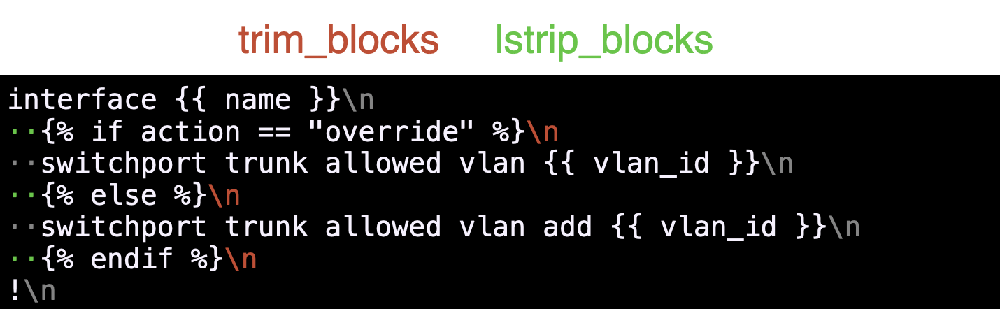
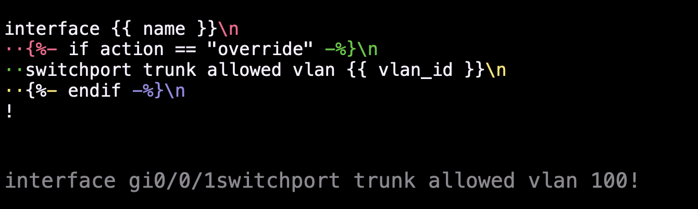

# Jinja2

- [Jinja2](#jinja2)
  - [Описание](#описание)
  - [Базовый синтаксис](#базовый-синтаксис)
  - [Использование в коде](#использование-в-коде)
    - [`Template`](#template)
    - [`Environment`](#environment)
  - [Синтаксис](#синтаксис)
    - [Переменные](#переменные)
    - [`for`](#for)
    - [`if/elif/else`](#ifelifelse)
    - [Фильтры](#фильтры)
  - [Контроль whitespaces](#контроль-whitespaces)
    - [Автоматический контроль](#автоматический-контроль)
    - [Ручной контроль](#ручной-контроль)
  - [Тесты](#тесты)
  - [Область видимости](#область-видимости)
  - [Загрузчики](#загрузчики)
    - [`DictLoader`](#dictloader)
  - [Иерархия шаблонов](#иерархия-шаблонов)
    - [`include`](#include)
    - [`extends`](#extends)

## Описание

[Jinja2](https://jinja.palletsprojects.com/) - популярный язык написания шаблонов в Python экосистеме. Может искользоваться как самостоятельно, так и внутри крупных и не очень фреймворков, например такие как [Django](https://docs.djangoproject.com/fr/4.2/topics/templates/), [FastAPI](https://fastapi.tiangolo.com/advanced/templates/), [Ansible](https://docs.ansible.com/ansible/latest/playbook_guide/playbooks_templating.html), [SaltStack](https://docs.saltproject.io/en/latest/topics/jinja/index.html).

Основная идея шаблонизатора - разделить шаблоны, данные и код.

Результат работы шаблонизатора - текст любой структуры: clear text, CSV, JSON, YAML, XML, ...

Перед использованием необходимо установить:

```shell
pip install jinja2
```

И импортировть в коде:

```python
import jinja2
```

## Базовый синтаксис

В качестве основы используется тот текст, который нужно получить в результате работы шаблонизатора. Вариативные части заменяются именованными переменными. При компиляции шаблона, значения из переменных подставляются в шаблон.

- `{# комментарий #}`: комментарий в шаблоне, игнорируется компилятором
- `{{ variable }}`: переменная `variable`, значение из которой будет подставлено в шаблон

```jinja
{# simple jinja template #}
!
no service pad
no service dhcp
!
hostname {{ hostname }}
!
interface Loopback0
 description mgmt
 ip address {{ mgmt_ip }} 255.255.255.255
!
router ospf 1
 router-id {{ mgmt_ip }}
 network 10.0.0.0 0.255.255.255 area 0
!
```

## Использование в коде

Существует два варианта использования:

- напрямую через класс `Template` (простой и быстрый вариант)
- создание окружения через класс `Enviroment` (сложнее, но дает больше возможностей)

### `Template`

Самый просто вариант использования Jinja, напрямую получаем шаблон, например из файла, и генерируем текст (конфигурацию) на его основе.

```python
from pathlib import Path

# импортируем Template из библиотеки jinja2
from jinja2 import Template

# читаем файл в шаблоном
with open("./templates/01.simple.template.j2", "r") as f:
    template_raw = f.read()

# создаем экземпляр класса Template на основе прочитанного шаблона 
template = Template(template_raw)

# получаем итоговую конфигурацию, методом render(), передавая в неё
# значения переменных
config1 = template.render(
    hostname="rt-01-dc",
    mgmt_ip="10.255.255.101",
)

# значения переменных можно заранее подготовить в словарь
rt02 = {
    "hostname": "rt-02-dc",
    "mgmt_ip": "10.255.255.102",
}
# тогда в метод render() можно передавать словарь с переменными,
# а не каждую переменную отдельно
config2 = template.render(rt02)
```

### `Environment`

Перед получением шаблона необходимо создать окружение, в котором могут быть определены дополнительные настройки, такие как способ получения шаблонов, различные фильтры и прочее.

```python
from pathlib import Path

from jinja2 import Environment, FileSystemLoader

# задаем имя каталога, где находятся шаблоны (в примере добавляем ./templates к каталогу, в котором
# находится запускаемый py файл)
template_dir = str(Path(Path(__file__).parent, "templates"))
# определям способ получения шаблонов, в простом варианте это FileSystemLoader,
# т.е. шаблоны будут читаться с диска, из каталога определенного в template_dir
loader = FileSystemLoader(template_dir)

# создаем экземпляр класса Environment и передаем в качестве аргумента способ получения шаблонов
env = Environment(loader=loader)

# определяем имя шаблона, просто меняем расширение py на j2 у имени запускаемого py файла
template_file = str(Path(Path(__file__).name).with_suffix(".j2"))
# получаем сам шаблон, указав его имя
template = env.get_template(template_file)

# получаеи итоговый текст методом render(), передавая в него значения переменных (можно и через словарь)
config = template.render(
    hostname="rt-02-dc",
    mgmt_ip="10.255.255.102",
)
```

## Синтаксис

Три контрукционных блока:

- `{# ... #}` - блок комментариев: задание комментарием, в т.ч. многострочных
- `{{ ... }}` - блок переменных: доступ к значениям в переменных
- `` - блок выражений: управляющие выражения, циклы, условия, создание переменных и прочее

Основные используемые языковые конструкции:

- Комментарии: `{# this is comment #}` - игнорируются компилятором
- Переменные: `{{ variable }}` - будут заменены на значения из передаваемых данных, если значения нет, тогда будет замена на пустую строку
- Циклы:

    ```jinja
    
    interface {{ interface }}
      no shutdown
    !
    
    ```

  Позволяют итерироваться по коллекциям
- Условия:

    ```jinja
    
      switchport trunk allowed vlan {{ vlan_id }}
    
      switchport trunk allowed vlan remove {{ vlan_id }}
    
      switchport trunk allowed vlan add {{ vlan_id }}
    
    ```

  позволяют выстраивать логические конструкции и ветвление кода
- Фильтры

    ```jinja
    router ospf 1
      auto-cost reference-bandwidth {{ ref_bw | default(10000) }}
    ```

  позволяют проводить некоторые операции со значениями перед их подстановкой
- Определение перменных ``. Не требует закрывающего блока.

    ```jinja
    
    interface {{ interface }}
      
      
      
      ip address {{ addr }} {{ mask }}
      
    !
    
    ```

  позволяют создавать переменные внутри шаблона

### Переменные

Для всех типов переменных: `{{ name }}` - доступ к значению в переменной с именем `name`

Для последовательностей можно получить доступ к отдельному элементу через индекс: `{{ interfaces[1] }}`  - доступ ко второму элементу списка `interfaces`

Для словарей доступно два варианта доступа к значениям:

- указание ключа через точку: {{ interfaces.loopback0 }} - доступ к элементу словаря `interfaces` по ключу `loopback0`
- указание ключа в квадратных скобках: {{ interfaces["gi0/0/1.101"] }} - доступ к элементу словаря `interfaces` по ключу `gi0/0/1.101`

Кроме этого у переменных можно использовать методы (без inline модификации), например:

- `{{ interface.upper() }}` - преобразует текст в верхний регистр (то же самое можно и рекомендуется делать через фильтры, но прямой вызов метода так же допустим)
- `{{ interfaces.items() }}` - возвращает список из кортежей в виде пар (ключ, значение), как и в Python коде.

```python
from jinja2 import Template

template_raw = """
hostname {{ name }}

router ospf 1
 router-id {{ ospf.rid }}
 router-id {{ ospf["rid"] }}
 router-id {{ ospf['rid'] }}
 network 10.0.0.0 0.255.255.255 area {{ ospf.area }}
!

interface gi0/0/1
  switchport trunk allowed vlan add {{ vlans[0] }}
!
""".strip()

template = Template(template_raw)

data = {
    "name": "rt01-msk",
    "vlans": [101, 102, 103],
    "ospf": {
        "rid": "10.255.255.1",
        "area": {"a": "b"},
    },
}

config = template.render(data)
print(config)
```

### `for`

Цикл определятеся внутри блока выражений конструкцией вида `<тело цикла>`. Каждый открывающий тег `` должен быть закрыт тегом ``

```python
from jinja2 import Template

template_raw = """

interface {{ interface_name }}
  description {{ interface_data.description }}
  ip address {{ interface_data.ip }} {{ interface_data.mask }}
!

""".strip()

template = Template(template_raw)

interfaces = {
    "gi0/0/1": {
        "description": "primary interface",
        "ip": "10.0.0.1",
        "mask": "255.255.255.252",
    },
    "gi0/0/2": {
        "description": "backup interface",
        "ip": "10.0.1.1",
        "mask": "255.255.255.252",
    },
}

config = template.render(interfaces=interfaces)
print(config)
```

В примере в шаблоне мы итерируемся по словарю interfaces, и на каждой итерации получаем параметры очередного интерфейса, которые используем внутри тела цикла.

Кроме этого есть Jinja-specific переменные, доступные внутри цикла:

- `loop.index`, `loop.index0` - текущая итерация цикла, (index - начало с 1, index0 - начало с 0). В Python коде аналог можно получить использовав функцию `enumerate()`.

    ```python
    template_loop = """
    
    vlanid: {{ vlan }}, текущая итерация цикла {{ loop.index }}, имя vlan: {{ names[loop.index0]}}
    
    """.strip()

    template = Template(template_loop)
    print(
        template.render(
            vlans=[101, 102, 103, 104, 105],
            names=["voip", "user", "server", "mgmt", "wifi"],
        )
    )
    ```

- `loop.length` - длина последовательности, аналог `len()` в коде
- `loop.previtem`, `loop.nextitem` - предыдущий и следующие элементы последовательности, аналог в коде можно получить через прямой доступ по индексам
- `loop.changed(value)` - `True` если значение value на предудущей итерации было другое, `False` - если тоже самое

    ```python
    template_changed = """
    
      
    !
      
      
    peer {{ name }} {{ config }}
      
    
    """.strip()

    template = Template(template_changed)
    print(
        template.render(
            peers={
                "192.168.1.1": [
                    "remote-as 12345",
                    "description some peer",
                    "allowas-in",
                ],
                "192.168.1.2": [
                    "remote-as 11111",
                    "shutdown",
                ],
                "192.168.1.3": [
                    "remote-as 12345",
                ],
            }
        )
    )
    ```

Для управления ходом цикла доступны инструкции `` и ``. Работают аналогично `continue` и `break` в Python.

### `if/elif/else`

Операторы условия определяются внутри блока выражений ``. Каждое условие `if` должно быть закрыто тегом `endif`:

```jinja

...

...

...

```

Минимальные состав блоков: открывающий `` и  закрывающий ``. Блоки для альтернативных веток `` и `` опциональны и могут быть пропущены.

```python
from jinja2 import Template

template_raw = """

interface {{ name }}
  
  switchport trunk allowed vlan {{ data.vlan_id }}
  
  switchport trunk allowed vlan remove {{ data.vlan_id }}
  
  switchport trunk allowed vlan add {{ data.vlan_id }}
  
!

""".strip()

template = Template(template_raw)

interfaces = {
    "gi0/0/1": {"action": "remove", "vlan_id": 101},
    "gi0/0/2": {"action": "override", "vlan_id": 102},
    "gi0/0/3": {"action": "", "vlan_id": 103},
}

config = template.render(interfaces=interfaces)
print(config)
```

### Фильтры

- Фильтры позволяют модифицировать значения переменных перед подстановкой их в шаблон.
- Фильтры могут идти друг за другом, тогда значения будет передаваться в филтры по цепочке
- Фильтры могут принимать параметры

Существуют встроенные в ядро Jinja2 [фильтры](https://jinja.palletsprojects.com/en/3.0.x/templates/#list-of-builtin-filters), но они так же могут быть написаны самостоятельно или установлены из публичных репозиториев.

- `{{ name | default("unknown") }}` - значение по умолчанию (часто используемый фильтр - есть alias `d`)
- `{{ trunk_data.vlans | join(",") }}` - склеивает элементы списка в строку (как join в Python)
- `{{ trunks | dictsort }}` - сортирует словарь
- `{{ loud | capitalize }}` - работа с регистром строки, аналогично lower, title, upper
- `{{ list | first }}` - возвращает первый элемент списка (last — последний)
- `{{ "rm_%s_to_%s_%s" | format("PE", "RR", "MSK") }}` - форматирование строк
- `{{ vlans | length }}` - длина списка
- `{{ string_with_spaces | trim }}` - отрезать пробелы в начале и конце строки
- `{{ loud | lower | list | join(" ") }}` - конвеер фильтров

## Контроль whitespaces

При компиляции Jinja2 обрабатывает блоки выражений и сам код не включается в итоговый текст. Но при написании шаблона вокруг блоков выражений есть пробельные символы, например переносы строк, пробелы для лучшей читаемости и прочее. Эти пробельные символы попадают в итоговый текст и в результате получаются лишние пустые строки. Можно контролировать обработку пробельных символов до/после блоков выражений в ручном или автоматическом режиме.

### Автоматический контроль

При создании объектов `Template` и `Environment` можно передать два аргумента:

- `trim_blocks` - удаляет первый символ перевода строки после блока
- `strip_blocks` - удаляет пробелы и табуляцию с начала строки до блока выражения

```python
template = Template(
    template_str,
    trim_blocks=True,
    lstrip_blocks=True,
)

env = Environment(
    loader=FileSystemLoader("."),
    trim_blocks=True,
    lstrip_blocks=True,
)
```

<p align="center"></p>

### Ручной контроль

При открытии/закрытии блока выражений, можно указывать управляющие символы `-` и `+`:

- `` - удаляет пробелы после блоком (в т.ч. и перенос строки)
- `{%+` - отключает lstrip_blocks перед блоком (lstrip_block=False), если он был включен при создании Template/Environment

<p align="center"></p>

## Тесты

Специальные конструкции, позволяющие проверять переменные на какие-либо условия. Можно использовать встроенные, или написать самому (аналогично фильрам), и поместить в словарь `tests` экземпляра `Environment`.

- ``: определена переменная или нет
- ``: переменная булева или нет
- ``: переменная итерируемая
- ``: или число

```python

from jinja2 import Template

template_raw = """

interface {{ name }}
    description {{ data.desription }}
  
  swithport trunk allowed vlan {{ data.vlans | join(",") }}
  
  swithport trunk allowed vlan {{ data.vlans }}
  
!

""".strip()

template = Template(template_raw, lstrip_blocks=True, trim_blocks=True)

interfaces = {
    "gi0/0/1": {
        "desription": "PEER SW",
        "vlans": [101, 102, 103],
    },
    "gi0/0/2": {
        "vlans": 102,
    },
}

config = template.render(interfaces=interfaces)

print(config.replace("\n\n", "\n"))
```

## Область видимости

Созданные переменные доступны только внутри блока, где они были созданы. Например, если переменная была создана внутри цикла `for`, то на каждой итерации значения переменной будет сбрасываться, и после закрытия этого цикла блоком `endfor`, переменная перестает быть доступна. Что бы использовать созданные переменные за пределами блоков, где они были созданы, нужно сохранять значения в переменных из глобального адресного пространства.

```python
from jinja2 import Template

template_raw = """




  

  

vlan {{ vlan_id }}
  name {{ vlan_name }}
!



interface {{ trunk }}
  switchport trunk allowed vlan {{ ns.vlan_from }}-{{ ns.vlan_to }}
!

""".strip()

template = Template(template_raw, lstrip_blocks=True, trim_blocks=True)

data = {
    "vlans": {
        101: "user",
        102: "voip",
        103: "server",
        104: "mgmt",
    },
    "trunks": [
        "gi0/0/1",
        "gi0/0/2",
    ],
}

config = template.render(data)

print(config)
```

Кроме этого существует конструкция `...`, которая создает локальную область видимости внутри блока, и позволяющая одновременно создавать переменные.

```jinja

interface {{ interface }}
  switchport mode {{ modes[interface] }}
!

```

## Загрузчики

Загрузчики определяют способ получения шаблонов.

- `FileSystemLoader(directory)`: загрузка с файловой системы, аргумент - каталон с расположением шаблонов
- `DictLoader(dict)`: загрузка из словаря. Ключи - имена шаблонов, значения - сами шаблоны (в str)
- `FunctionLoader(func_name)`:  загрузка вызовом функции, которая, в простом варианте, возвращает строку с шаблоном
- `ChoiceLoader([loader1, loader2])` - объединяет несколько загрузчиков и пробует по очереди пока не получит шаблон

### `DictLoader`

Пример использования `DictLoader`:

```python
from pathlib import Path
from typing import Literal

from jinja2 import DictLoader, Environment


def get_template_text(device_type: Literal["sw", "rt"]) -> str:
    """функция для чтения файлов с шаблонами в строку

    Args:
        device_type: (str): тип устройства "sw" или "rt"

    Returns:
        str: шаблон в виде строки
    """
    template_file = Path(
        Path(__file__).parent,
        "templates",
        Path(__file__).name,
    ).with_suffix(f".{device_type}.j2")
    with open(template_file, "r") as f:
        template_text = f.read()
    return template_text


# создаем DictLoader с двумя типами шаблонов: для маршрутизатора и коммутатора
loader = DictLoader(
    {
        "router": get_template_text("rt"),
        "switch": get_template_text("sw"),
    }
)
# загрузка шаблонов в Environment
env = Environment(loader=loader)

# входные данные для генерации конфигурации
devices = [
    {
        "type": "router",
        "name": "rt1",
        "mgmt_ip": "192.168.1.101",
    },
    {
        "type": "switch",
        "name": "sw1",
        "mgmt_ip": "192.168.1.102",
        "access_vlan": 100,
        "if_name": "Gi1/0/1",
    },
]
# генерация конфига в зависимости от типа устройства
for device in devices:
    device_type = device["type"]
    template = env.get_template(device_type)
    config = template.render(device)
    print("-" * 10, "config of", device["name"])
    print(config)
```

## Иерархия шаблонов

Важной особенностью Jinja2 является возможность построение иерархии шаблонов. Иерархия позволяет избавится от дублирования кода, разбить сложный и объемный шаблон на несколько маленьких, упростив, тем самым управление ими.

Два способа выстраивания иерархии:

- использование директивы ``
- использование наследование шаблонов ``

### `include`

Директива `include` позволяет включить один шаблон в другой.

```jinja

    {% include "./13.include.interfaces.%s.j2" | format(data.type) +%}



```

шаблон `./13.include.interfaces.server.j2`

```jinja
interface {{ interface }}
  description SERVER
  
  ip address {{ ip | ip_address }} {{ ip | ip_netmask }} secondary
  
!
```

шаблон `./13.include.interfaces.user.j2`

```jinja
interface {{ interface }}
  description USER
  
  ip address {{ ip | ip_address }} {{ ip | ip_netmask }} secondary
  
!
```

шаблон `./13.include.ospf.j2`

```jinja
router ospf 1
  
    
      
  network {{ ip | ip_network }} {{ ip | ip_wildcard }} area {{ data.ospf.area }}
      
    
  
!
```

### `extends`

Директива `extends` позволяет наследовать один шаблон от другого.

- Базовый шаблон - заготовка. Содержит все то, что и обычный шаблон + опциональные блоки ` ... `
- Дочерний шаблон - генерируется на основе базового шаблона, расширяя его содержимое через директиву ``
- В дочернем шаблоне все описание производится только внутри блоков ` ... `. Все, что вне блоков, будет проигнорировано
- Дочерние шаблоны могут переписывать (переопределять) содержимое блоков базового шаблона
- Используя директиву `{{ super() }}` можно сохранить содержимое блока базового шаблона и дополнить его

Базовый шаблон

```jinja
!
{#
    блок services, в дочернем шаблоне можно
    - не указывать его, тогда содержимое будет наследовано
    - указать, тогда содержимое будет стерто и заменено тем, что будет написано в дочернем шаблоне
    - указать и использовать super(), тогда содержимое базового шаблона можно скопировать в ту строку, 
      где был вызов super(), а до/после вызова можно добавить свой уникальный текст
#}

no service pad
no service dhcp
service tcp-keepalives-in
service tcp-keepalives-out
service timestamps debug datetime msec localtime show-timezone
service timestamps log datetime msec localtime show-timezone
service password-encryption

!
{#
    текст вне блока, его нельзя удалить/изменить/добавить, остается всегда
#}
no ip domain lookup
ip ssh version 2
!
aaa new-model
aaa authentication login default local
aaa authentication login CON none
aaa authorization exec default local 
!
mpls ldp router-id Loopback0 force
mpls label protocol ldp
mpls ldp igp sync holddown 2000
mpls ldp label
  allocate global host-routes
!

router ospf 1
  auto-cost reference-bandwidth {{ ospf_bw | default(200000) }}

!
{#
    пустой блок-заготовка, так как дочерний шаблон может только переиспользовать родительские блоки,
    но не может создавать новых, поэтому базовый шаблон содержит блоки для заполнения (при необходимости)
    в дочерних шаблонах
#}


!


!
line con 0
  privilege level 15
  logging synchronous
  login authentication CON
  exec prompt timestamp
  stopbits 1
line vty 0 15
  logging synchronous
  exec prompt timestamp
  transport input all
!
```

Дочерний шаблон

```jinja
{#
    директива говорит, что мы наследуемся от другого шаблона
#}


{#
    тут мы можем переопределять только содержимое блоков родительского шаблона
    например такой конструкцией мы стираем все, что было в блоке service базового шаблона
#}




{#
    блок ospf мы так же переопределяем 
#}

{#
    можем вписать какой-либо свой текст
#}
! my ospf configuration
!
{#
    директива super() позволяет скопировать содержимое блока базового шаблона в место вызова директивы
#}
{{ super() }}
{#
    после копирования дополняем своей собственной информацией
#}
  
    
      
  network {{ ip | ip_network }} {{ ip | ip_wildcard }} area {{ data.ospf.area }}
      
    
  


{#
    текст вне блоков будет полностью проигнорирован
#}
----
those lines will be removed (not part of any block)
----

{#
    внутри блоков можем использовать любые уже известные конструкции языка,
    например циклы и включение сторонних шаблонов
#}

! interface configuration
!
  
    {% include "./14.extend.interface.%s.j2" | format(data.type) +%}
  

```
