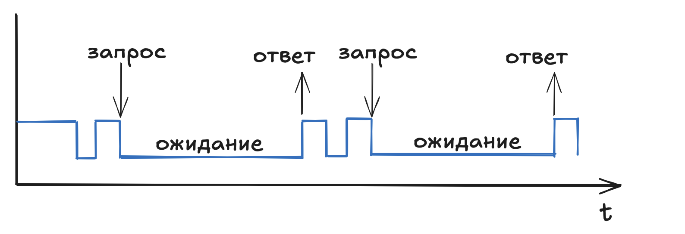
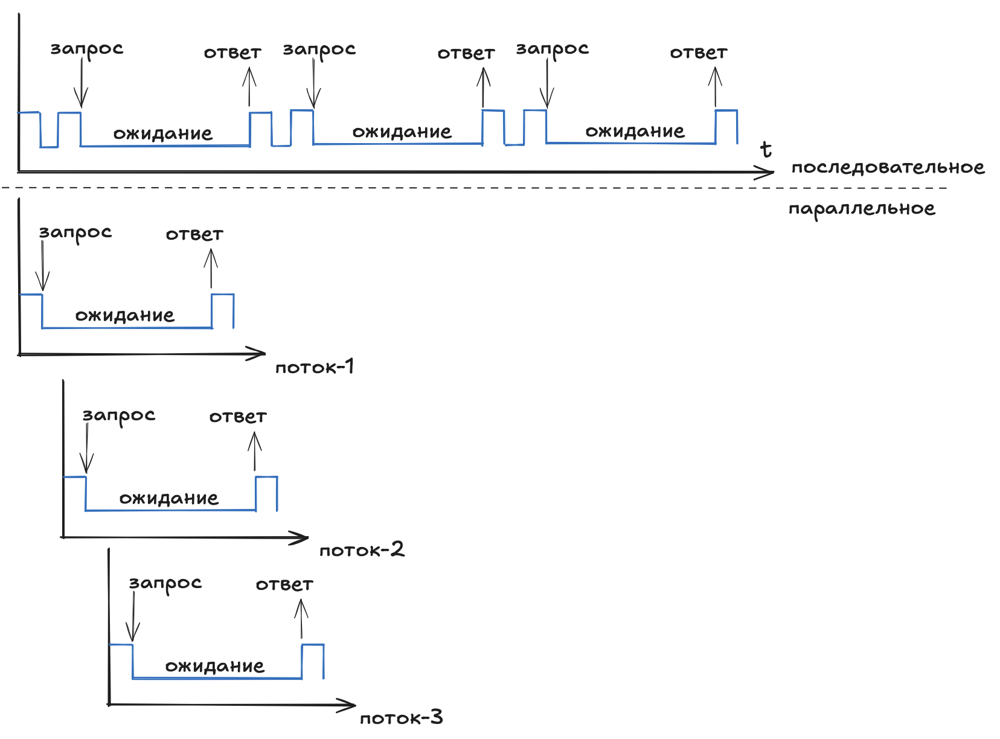
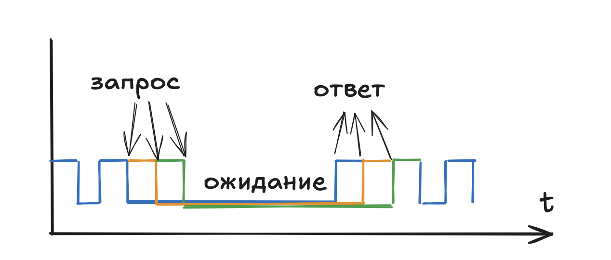

# Многозадачность на основе multithreading

- [Многозадачность на основе multithreading](#многозадачность-на-основе-multithreading)
  - [Описание](#описание)
  - [Последовательное / конкурентное / параллельное выполнение](#последовательное--конкурентное--параллельное-выполнение)
  - [CPU-bound / IO-bound](#cpu-bound--io-bound)
  - [IO-bound](#io-bound)
  - [Async](#async)
  - [Реализация в Python](#реализация-в-python)

## Описание

Многозадачность - свойство операционной системы обеспечивать возможность одновременной обработки нескольких задач.

Есть два вида многозадачности:

- процессная
- поточная

Процессорная многозадачность основана на процессах. Процесс это независимый экземпляр программы. У каждого процесса свое собственного адресное пространство в памяти и свои собственные ресурсы. Можно рассматривать процессорную многозадачность как просто запуск еще одной копии программы. Процессы не связаны между собой и могут работать независимо.

Потоковая многозадачность основана на потоках в рамках одного процесса. Поток выполняет какую-то свою отдельную подзадачу в рамках одной программы. Потоки, как часть одного процесса, разделяют общее адресное пространство и имеют общий доступ к ресурсам процесса (память, файлы и пр).

У каждой программы есть как минимум один процесс, а у каждого процесса есть как минимум один поток.

## Последовательное / конкурентное / параллельное выполнение

Последовательное выполнение (sequential) это выполнение инструкций кода по очереди одну за одной, весь рассматриваемый ранее в примерах код был последовательным.

Конкурентное выполнение (concurrent) это одновременное выполнение некоторого числа задач за единицу времени. При этом термин не фиксирует как именно будет достигнута одновременность выполнения, это может быть реализовано за счет приостановки одних задач и выполнения в этот момент других, а может быть за счет использования нескольких вычислительных ресурсов.

Параллельное выполнение (parallelism) уточняет конкурентное в плане подхода, явно фиксируя, что для задачи будут выполняться на разных вычислительных ресурсах.

## CPU-bound / IO-bound

Все операции можно условно разделить на блокирующие и не блокирующие.

Неблокирующие операции работают только с CPU и зачастую занимаются вычислениями, сильно нагружают CPU, а скорость их выполнения зависит от возможностей самого CPU.

Блокирующие операции это операции связанные с ожиданием информации от какой-либо внешней системы/ресурса. Например ввод с клавиатуры, чтение файлов, консольный вывод или ответ от сетевого устройства.

Операции, связанные только с работой CPU называют CPU-bound и они в основном выполняют неблокирующие операции.
Операции, связанные с подсистемой ввода/вывода называют IO-bound и они в основном выполняют блокирующие операции.

Взаимодействие с сетевым оборудование относится к IO-bound операциям, поэтому рассматриваем только особенности этого типа.

## IO-bound

IO-bound операции для последовательного вычисления выглядят следующим образом

Ожидание ответа блокирует выполнение программы и общее время выполнения сильно увеличивается, но при этого время полезной работы (вычислений) может сильно уступать времени простоя.

Выполнение таких задач можно ускорить, если выделить каждую блокирующую задачу в отдельный поток.

Длительность выполнения в таком случае сильно сокращается, так как запросы инициируются практически одновременно разными потоками.

## Async

За создание потоков отвечает операционная система и это достаточно ресурсозатратный процесс (выделяются дескрипторы, планировщик начинает следить и управлять всем потоками и пр.). И при этом все равно в рамках одного потока будет простой по времени, пока программа ожидает ответа от внешнего источника.

Как альтернатива потокам существует асинхронный подход к такому рода задач. В этом походе код выполняется в одном потоке, но переключение между подзадачами все равно происходит за счет внутреннего планировщика по мере перехода подзадачи в режим ожидания. Т.е. управлением использования процессорным временем занимается не планировщик операционной системы, а внутренний планировщик python. Для операционной системы такая программа остается однопоточной.

## Реализация в Python

В Python описанные подходы реализуются соответствующими встроенными библиотеками

- многопоточность: `threading`
- многопроцессность: `multiprocessing`
- асинхронность: `asyncio`

Кроме этого в Python существует GIL - Global Interpreter Lock. Который обеспечивает безопасность совместного доступа к ресурсам за счет того, что в каждый момент времени исполнятся может только одна инструкция.

С учетом GIL можно получить такие правила:

- многопоточность: `threading`, конкурентное выполнение CPU-bound и IO-bound операций
- многопроцессность: `multiprocessing`, параллельное выполнения CPU-bound операций
- асинхронность: `asyncio`, кооперативное выполнение IO-bound операций в одном потоке

В теории для IO-bound операций (а обращение к сетевым устройствам это IO-bound) можно сказать, что асинхронный подход может быть более предпочтителен так как обращений много и ответ от устройств медленный, поэтому потоки будут использоваться не рационально. Но на практике стоит учитывать, что асинхронный код намного сложнее последовательного (который в свою очередь достаточно просто перекладывается в потоки), а так же асинхронная работа поддерживается не всеми библиотеками.

> GIL - плата за простоту и безопасность python. Разработчику не нужно заботиться о проблемах, связанных с общими ресурсами (гонки, коллизии, блокировки и прочее). Обойти GIL можно если использовать многопроцессность, или другую реализацию Python, например Jpython вместо CPython, или использовать С/С++ скомпилированные библиотеки (numpy, tensorflow, или написать свои).

[threading vs multiprocessing in python](https://www.youtube.com/watch?v=AZnGRKFUU0c)
[GIL на habr.com](https://habr.com/ru/companies/wunderfund/articles/586360/)
