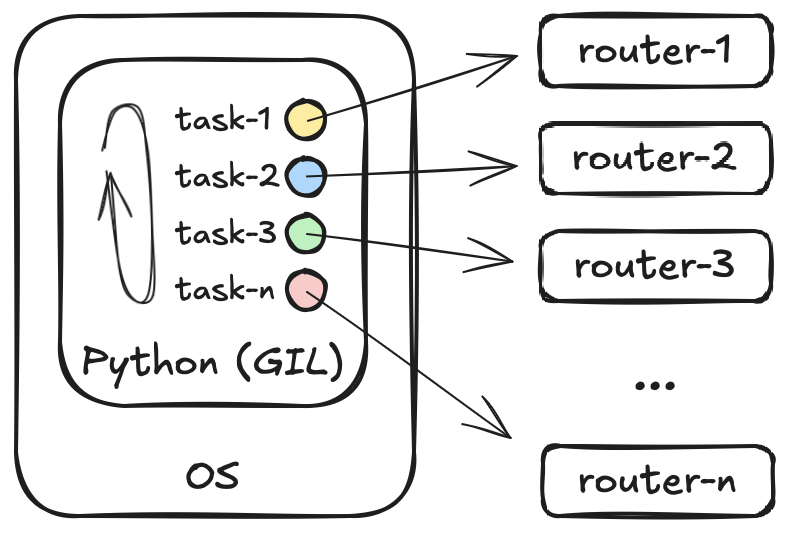

# Асинхронный код

- [Асинхронный код](#асинхронный-код)
  - [Описание](#описание)
  - [Запуск корутин](#запуск-корутин)
  - [Частые ошибки](#частые-ошибки)
  - [Минусы и плюсы](#минусы-и-плюсы)
  - [`async with` /  `async for`](#async-with---async-for)

## Описание

Одной из библиотекой для реализации асинхронного кода является `asyncio`. Это стандартная библиотека, дополнительно устанавливать ничего не нужно. Название библиотеки полностью отражает её назначение `async` - асинхронное выполнение, `io` - IO-bound операции. Существуют и другие фреймворки для выполнения асинхроных задач, но `asyncio` самый популярный и используемый.

Асинхронный код позволяет реализовать кооперативную многозадачность, в отличии от подхода многопоточности, где реализуется конкурентная многозадачность.

Кооперативная многозадачность, подпрограмма самостоятельно решают когда они могут встать на паузу и отдать процессорное время соседним подпрограммам (в python это определяет сам разработчик). В конкурентной многозадачности за распределение процессорного времени отвечает планировщик операционной системы. При этом асинхронный код работает в одном потоке и на него так же действует GIL и в каждый момент времени может выполнятся только одна инструкция (как и в многопоточном подходе).

Суть асинхронного программирования в том, что IO-bound задачи очень медленные и пока мы ждем ответа от внешней системы мы можем задачу, которая ждет ответа, поставить на паузу, и начать обрабатывать следующую задачу. Когда данные из внешней системы будут получены, управление возвращается первой задачи и она продолжает свою работу.

<p align="center"></p>

Ключевые компоненты, необходимые, что бы обеспечить работу асинхронного кода:

- механизмы оповещения о том, что запрошенные данные получены. Это решается средствами операционной системы и в текущий момент нам не интересны
- выполняемая асинхронная функция должна умень вставать на паузу пока ждет внешнего ответа. В этом плане такие асинхронные функции очень похожи на функции-генераторы (`yield`), которые так же запоминают свою состояние и встают на паузу до очередного к ним обращения
- как и в случае с функциями-генераторами, которые используют специальную инструкцию `yield` вместо стандартного `return`, асинхронная функция так же должна быть каким-либо образом явно отделена в коде от стандартной последовательной функции. Эта задача решается использованием конструкции `async def` вместо обычного `def` при определении функции. Такие функции называются корутинами (coroutine)
- асинхронные функции умеют вставать на паузу в ожидании данных, но это должно происходить в какой-то определенный момент. Нужна языковая конструкция, которая даст понять интерпретатору (и разработчику), что в данном месте кода функция ожидает данных и готова передать ресурсы процессора другим асинхронным функциям. Такой конструкцией является `await`
- нужен некий механизм, контролирующий работу всех асинхронных функций, похожий на диспетчер задач в операционной системе, только внутри python. Такой механизм существует и называется `event loop`

Часть конструкций появилось в Python v3.4, часть в v3.5.

## Запуск корутин

Само по себе создание корутины не означает её запус для исполнения. Аналогично функциям-генераторам - создание объекта не равно исполнению кода внутри функции.

Есть несколько способов запустить корутину (запустить корутину значит поместить ей в цикл событий - loop event - для исполнения):

- `await` - самый простой способ, это ключевое слово преостанавливает работу корутины, где оно было применено и одновременно с этим запускает другую корутину, результат которой мы ожидаем. Такой способ запуска является блокирующим
- `asyncio.create_task(<coro>)` - метод запускает корутину в существующем цикле событий и возвращает объект `asyncio.Task`. Этот объект позволяет управлять корутиной (останавливать, проверять статус и пр). Такой способ запуска является неблокирующим
- `asyncio.run(<coro>)` - метод создает цикл событий и запускает в нем корутину. Обычно этот метод применяется как точка входа в программу. Метод блокирующий
- `loop = asyncio.new_event_loop()` + `loop.run_until_complete(<my_coro>)` - старый вариант запуска основной корутины (точки входа в программу), сейчас (c v3.7) можно использовать только `asyncio.run`. С другой стороны, создание цикла (старый вариант) дает больший контроль, и в некоторых случаях, когда требуется более тонкая настройка, можно пользоваться им
- `asyncio.gather(<coro1>, <coro2>, ... <coroN>)` - позволяет запустить и получить результаты сразу нескольких корутин (метод дожидается выполненения всех корутин)
- `asyncio.wait(<coro1>, <coro2>, ... <coroN>)` - так же позволяет запустить и дождаться выполения всех корутин, дополнительно можно указать условия завершения, например время ожидания, или стратегий ожидания (например ждем кто быстрее завершится, потом все остальные снимаем)
- `as_completed(<coros>)` - позволяет запустить корутины (или таски) и возвращать коррутины по мере их готовности

## Частые ошибки

При написании асинхронного кода часто можно столкнуться со следующими ошибками:

- попытка использования корутины как функции. Т.е. создание объекта корутины без его запуска и ожидания. В этом случае python будет выводить предупреждение вида `RuntimeWarning: coroutine '<coro-name>' was never awaited`. Обычно это опечатки в виде забытого `await`
- не использование `await` внутри корутин. Обычно это говорит о том, что эта функция не должна быть корутиной и есть вопросы к архитектуре приложения
- использование внутри корутин синхронного кода. Такой подход уничтожает все плюсы использования асинхронного кода
- несмотря на наличие `io` в названии библиотеки, это относится только к асинхронным операциям ввода-вывода. Попытка использовать синхронные библиотеки для реализации IO операций в асинхронном коде является ошибкой

## Минусы и плюсы

Хорошая управляемость: разработчик самостоятельно решает в какой момент можно перелючаться между корутинами при помощи `await` (это и есть кооперативная многозадачность) в отличии от многопоточности, где переключение между потоками происходит принудительно планировщиком операционной системы (вытесняющая многозадачность) и разрабочик не может на это влиять.

Хорошая управляемость при неправильном использовании может привести к деградации асинхронного кода, когда в коррутине будут использоваться блокирующие вызовы или вообще отстсвует использование `await`. Так как цикл событий переключается только в точках, обозначенных через `await` (у него нет принудительного переключения), то попав в такую корутину, цикл событий останется в ней пока её инструкции не закончаться, и переключения между коррутинами не будет.

Асинхронный код трерубует использование специальных асинхронных библиотек/объектов:

- нельзя: `ConnectHandler` (netmiko),  `Scrapli` (scrapli), `requests`, `flask` (ниже 2.0)
- можно: `AsyncScrapli` (scrapli), `httpx` или `aiohttp`, `fastapi`

Корутины дешевле (легковеснее) с точки зрения ресурсов чем потоки. Быстрее создаются и быстрее переключаются. Но ускорение, которое дает asyncio не бесконечно.

Говорить о том, что код на `asyncio` драматично быстрее чем код на `threading` нельзя. Хорошо написанный код будет одинаково быстро работать при использовании любого из подходов и разница в скоростях будет крайне незначительной и может быть списана на погрешность. Скорость работы не должна быть критерием выбора между асинхронным кодом и многопоточным. Асинхронный код можно выбирать когда нужно самостоятельно настроить места переключения между задачами, когда есть поддержка асинхронного кода со стороны используемых библиотек, когда есть жесткие требования по ресурсам.

## `async with` /  `async for`

Менеджер контекста и итерация реализуются соответсвующими дандер-методами. В последовательном коде это обычные функции и в их теле нельзя использовать `await`. Поэтому существуют асинхронные варианты для реалиции менеджера контекста и итераторов:

- `__iter__` -> `__aiter__` - возвращает асинхронный итерируемый объект
- `__next__` -> `__anext__` - возвращает очередной объект из асинхронного итерируемого объекта
- `StopIteration` -> `StopAsyncIteration` - исключении при исчерпании генератора
- `__enter__` -> `__aenter__` - корутина запускаемая при входе в асинхронный менеджер контекста
- `__exit__` -> `__aexit__` - корутина запускаемая при выходе в асинхронный менеджер контекста

С точки зрения разработчка, в первом приближении, о конструкциях вида

```python
async with AsyncScrapli(**device) as ssh:
    output = (await ssh.send_command("show version")).result
```

```python
import asyncio
from typing import AsyncGenerator


async def acounter(delay: int) -> AsyncGenerator[int, int]:
    c = 0
    while True:
        c += 1
        await asyncio.sleep(delay)
        yield c


async def main() -> None:
    async for i in acounter(1):
        print(i)


if __name__ == "__main__":
    asyncio.run(main())
```

можно сказать то, что они работают с асинхронным объектам, дргих изменений нет.
