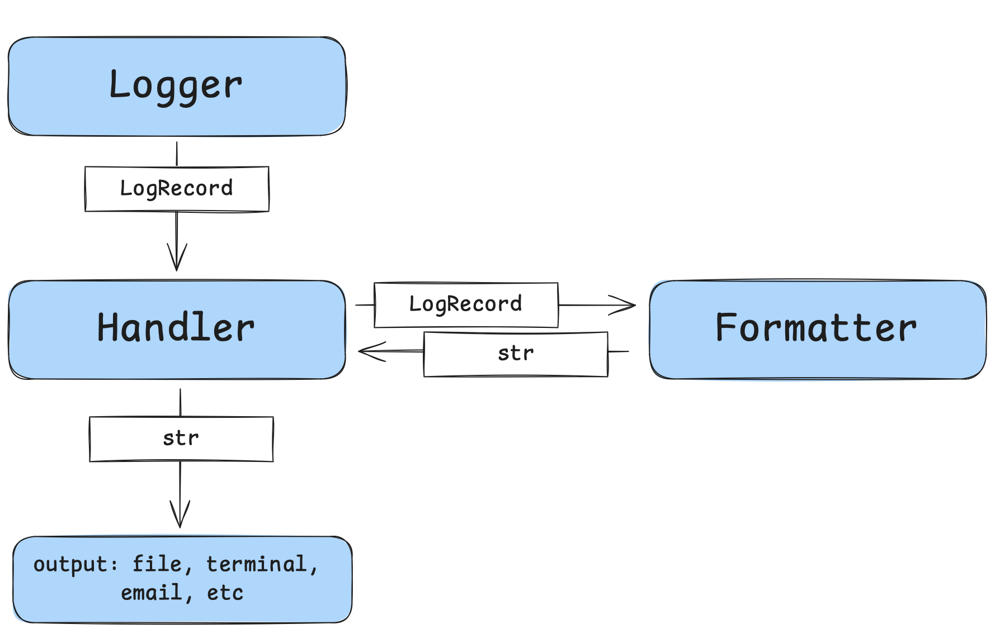

# logging

- [logging](#logging)
  - [Описание](#описание)
  - [Основные компоненты](#основные-компоненты)
  - [Logger](#logger)
  - [Уровни логирования](#уровни-логирования)
  - [basicConfig](#basicconfig)
  - [Handler](#handler)
  - [Formatter](#formatter)
  - [Способы конфигурации](#способы-конфигурации)
  - [Ссылки](#ссылки)

## Описание

Модуль `logging` является встроенным модулем и служит для предоставления возможности логировать сообщения во время работы программы. Может гибко настраиваться, тем самым обеспечивая требуемый функционал и дифференциацию логируемых сообщений.

## Основные компоненты

Основными компонентами являются

- `Logger` - логгер, предоставляющий API для работы с системой логирования
- `LogRecord` - запись с сообщением, помимо самого сообщения содержит другие служебные параметры, например важность, имя функции, в которой запись была создана и пр
- `Handler` - обработчик логов, отвечает за работу с определенными получателями сообщений (файл, терминал, электронная почта, syslog сервер и пр)
- `Formatter` - преобразует LogRecord по заданному правилу в строку

<p align="center"></p>

## Logger

Логгер создается функцией `getLogger`, в качестве аргумента может передаваться имя логгера, но если его нет, то создается корневой логгер.

```python
import logging

log = logging.getLogger()

log.warning("WARNING MESSAGE")
```

Логгер реализует паттерн singleton, поэтому на всё приложение может быть только один логгер с определенным именем.

## Уровни логирования

Уровни логирования задаются числом

| level | value |
|--|:--:|
| CRITICAL | 50 |
| ERROR | 40 |
| WARNING | 30 |
| INFO | 20 |
| DEBUG | 10 |
| NOTSET | 0 |

но для удобства есть встроенные константы.

```python
logging.CRITICAL
logging.FATAL
logging.ERROR
logging.WARNING
logging.WARN
logging.INFO
logging.DEBUG
logging.NOTSET
```

Уровни логирования существуют как у самих логгеров, так и обработчиков логов. Устанавливаются через метод `setLevel()`

```python
import logging

log = logging.getLogger()
print(log)
# <RootLogger root (WARNING)>
log.setLevel(logging.DEBUG)
print(log)
# <RootLogger root (DEBUG)>
```

## basicConfig

Функция `basicConfig` позволяет сделать быструю настройку системы логирования, возможности её ограничены, но для базового включения вполне может подойти.

```python
import logging

logging.basicConfig(
    filename="app.log",
    filemode="w",
    level=logging.DEBUG,
    encoding="utf-8",
)
log = logging.getLogger()


def main() -> None:
    log.info("INFO MESSAGE")
    log.warning("WARNING MESSAGE")


if __name__ == "__main__":
    main()
```

## Handler

Обработчик логов, получает записи в виде LogRecord и направляет их в соответствующую подсистему. Наиболее используемые обработчики:

- `StreamHandler` - вывод в stderr
- `SysLogHandler` - отправка syslog
- `FileHandler` - сохранение в файл
- `RotatingFileHandler` - сохранение в файл с ротацией

Посмотреть назначенные обработчики можно через атрибут логгера `handlers`. Если назначенных обработчиков нет (пустой список), то по умолчанию создается обработчик типа `StreamHandler` без возможности настройки.

Создаются обработчики как обычные экземпляры соответсвующих классов:

```python
log = logging.getLogger("myapp")
log.setLevel(logging.DEBUG)

sh = logging.StreamHandler()
sh.setLevel(logging.DEBUG)

fh = logging.FileHandler(filename="./app.log", mode="w")
fh.setLevel(logging.INFO)

log.addHandler(sh)
log.addHandler(fh)
```

Как и с логгером, у обработчика есть метод `setLevel` устанавливающий минимальный уровень логирования. После создания и настройки обработчика его нужно добавить в логгер через метод `addHandler`.

## Formatter

Объект класса `Formatter` определяет то, каким образом `LogRecord` будет преобразован в строку. Для определения формата доступны к использованию атрибуты LogRecord, полный список которых есть в [документации](https://docs.python.org/3/library/logging.html#logrecord-attributes).

```python
import logging

log = logging.getLogger("myapp")
log.setLevel(logging.DEBUG)

sh = logging.StreamHandler()
sh.setLevel(logging.DEBUG)
fmt = logging.Formatter(
    fmt="%(asctime)s - [%(levelname)s] - (%(filename)s).%(funcName)s(%(lineno)d) - %(message)s",
    datefmt="%Y-%m-%d %H:%M:%S",
)
sh.setFormatter(fmt)

log.addHandler(sh)


def main() -> None:
    log.info("INFO MESSAGE")
    log.warning("WARNING MESSAGE")


if __name__ == "__main__":
    main()
```

## Способы конфигурации

Существуют три способа настройки логгера:

- напрямую внутри кода
- из словаря
- из файла в формате ini

## Ссылки

- [logging-cookbook](https://docs.python.org/3/howto/logging-cookbook.html) - примеры из документации
- [loguru](https://github.com/Delgan/loguru) - очень хорошая альтернатива стандартному logging